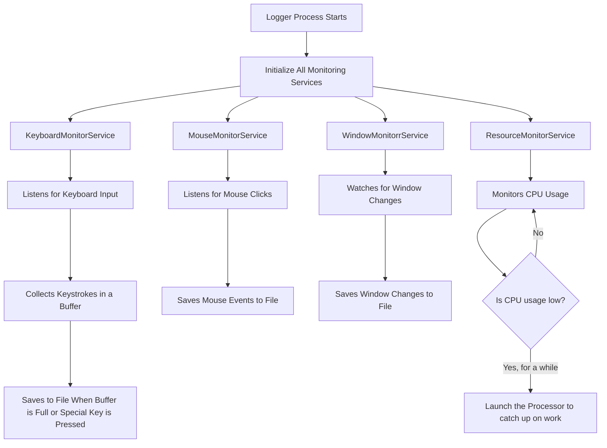
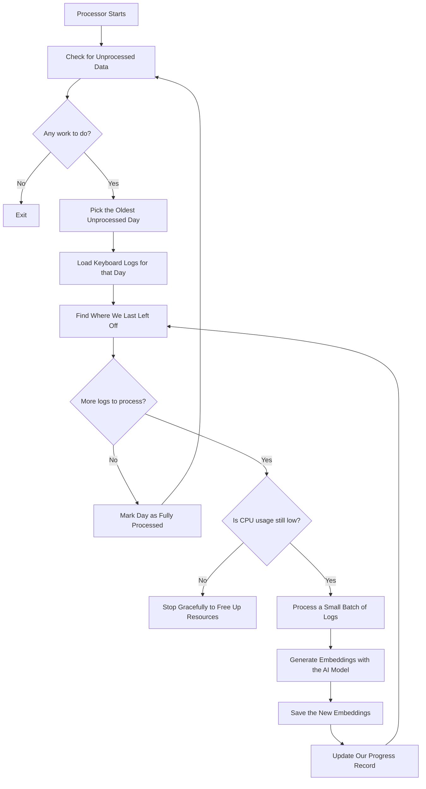
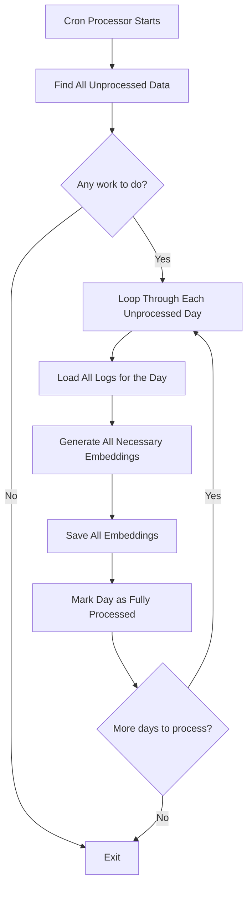
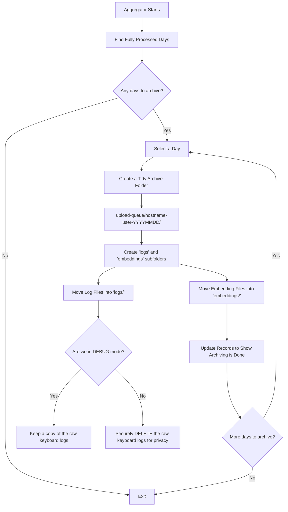

# LLM Embeddings CPU - A Friendly Technical Guide

Welcome to the LLM Embeddings CPU project! This document is your friendly guide to understanding the entire codebase. Whether you're a Computer Science, Electrical Engineering, or Data Science student, this guide is designed to give you a clear and complete picture of the project's architecture, logic, and how to work with it.

## Table of Contents

1.  [Project Architecture and Structure](#1-project-architecture-and-structure)
2.  [Program Logic and Service Interactions](#2-program-logic-and-service-interactions)
3.  [Data Services Architecture](#3-data-services-architecture)
4.  [Development Setup and Usage](#4-development-setup-and-usage)
5.  [Build and Deployment](#5-build-and-deployment)
6.  [Design Decisions and Debugging](#6-design-decisions-and-debugging)

---

## 1. Project Architecture and Structure

To understand how this project works, it helps to look at its overall design. We use a **layered architecture**, which is a popular and effective way to organize code. Think of it like a well-organized cake, where each layer has a specific job. This separation of concerns makes the code much easier to manage, test, and expand in the future.

### 1.1 Solution Structure Overview

Here’s a bird's-eye view of the project's folder structure. Each folder represents a different "layer" of our application cake.

```
LlmEmbeddingsCpu/
├── src/
│   ├── LlmEmbeddingsCpu.App/          # The starting point: configures and runs the app
│   ├── LlmEmbeddingsCpu.Core/         # The heart: contains core definitions and models
│   ├── LlmEmbeddingsCpu.Common/       # The toolbox: shared utilities for everyone
│   ├── LlmEmbeddingsCpu.Data/         # The librarian: handles all data storage
│   └── LlmEmbeddingsCpu.Services/     # The engine room: where the main work happens
├── prerequisites/                      # Extra tools the application needs to run
└── Output/                            # Where the final installer is saved
```

### 1.2 Project-by-Project Breakdown

Let's slice into that cake and look at each layer individually.

#### LlmEmbeddingsCpu.App (The Conductor)

This is the **entry point** of our application. When you run the program, this is where it all begins.
-   **Program.cs**: This file is the conductor of our orchestra. It reads the command-line arguments to decide which "mode" to run in, sets up all the necessary services through a process called **Dependency Injection**, and kicks everything off.
-   **deps/**: This folder holds the pre-trained machine learning model and its configuration files, which are essential for generating embeddings.

#### LlmEmbeddingsCpu.Core (The Blueprint)

This project defines the "what" of our application. It contains the core building blocks and contracts that the other projects use.
-   **Models/**: These are the data blueprints. They define the structure of the data we work with, such as `KeyboardInputLog` (for keystrokes) or `Embedding` (for the final AI-generated data).
-   **Interfaces/**: These are the contracts. For example, `IEmbeddingService` defines that *somewhere* in our application, there must be a service that can generate embeddings, but it doesn't care *how* it's done. This allows for flexibility and easier testing.
-   **Enums/**: These are predefined sets of options, like `LaunchMode`, which lists the different ways the application can run.

#### LlmEmbeddingsCpu.Common (The Shared Toolbox)

This small but important project holds shared tools and utilities that can be used by any other project in the solution.
-   **Extensions/**: Contains helpful utility functions. For instance, `StringExtensions.cs` includes a simple ROT13 "encryption" method for basic data privacy.

#### LlmEmbeddingsCpu.Data (The Librarian)

This layer is responsible for all data persistence—that is, reading from and writing to files. It acts as a clean interface between the application's logic and the file system.
-   Each sub-folder (e.g., `KeyboardLogIO`, `WindowLogIO`) contains a specialized service for handling a specific type of data. This keeps our data management tidy.
-   **FileSystemIOService**: This is the foundation. It provides the basic tools for file operations like reading, writing, and moving files, which all other data services use.

#### LlmEmbeddingsCpu.Services (The Engine Room)

This is where the magic happens. This layer contains the implementation of the application's main business logic.
-   **Monitoring Services/**: These services are the "collectors." They run in the background to monitor keyboard, mouse, and window activity using system-level hooks.
-   **Processing Services/**: These services are the "thinkers." They take the raw data collected by the monitors and use the machine learning model to turn it into valuable embeddings.
-   **Aggregation/**: This service is the "archivist." It cleans up, organizes, and archives the data once it has been fully processed.

---

## 2. Program Logic and Service Interactions

At its heart, this application is a data pipeline. It captures user activity, processes it into meaningful data (embeddings), and archives it. To manage this, the application can be run in four different **launch modes**, each acting as a specialized worker in our data assembly line.

### 2.1 Application Launch Modes

The application decides which role to play based on the command-line argument you give it:
-   `--logger`: Runs the background monitoring services to capture data.
-   `--processor`: Intelligently processes captured data when the computer is not busy.
-   `--cron-processor`: Forcefully processes all remaining data, usually on a schedule.
-   `--aggregator`: Cleans up and archives fully processed data.

### 2.2 Main Logger Process

The Logger is the primary data collector. It's designed to run continuously in the background without disturbing the user.



**Key Ideas:**
-   It runs quietly as a scheduled task from the moment you log in.
-   It cleverly buffers keyboard input, saving it in chunks to be efficient.
-   It keeps an eye on system resources and can launch a `Processor` instance when it sees the computer is idle.

**What it Produces:**
-   `keyboard_logs-YYYYMMDD.txt`: A daily log of keyboard input (text is obfuscated with ROT13).
-   `window_monitor_logs-YYYYMMDD.txt`: A daily log of window activity (titles are obfuscated).
-   `mouse_logs-YYYYMMDD.txt`: A daily log of mouse clicks.
-   `application-logger-YYYYMMDD.log`: A technical log for debugging the logger itself.

### 2.3 Continuous Processor

The Processor is the smart worker. It only runs when the computer isn't busy, ensuring it doesn't slow down the user's work.



**Key Ideas:**
-   It's **resource-aware**, constantly checking CPU usage and stopping if it gets too high.
-   It processes data in small **batches** for efficiency.
-   It **remembers its progress**, so it can be stopped and started without losing its place.

### 2.4 Cron Processor

The Cron Processor is the night-shift worker. It runs on a fixed schedule (e.g., at midnight) and its only job is to make sure every single piece of data gets processed, no matter what.



**Key Ideas:**
-   It **ignores resource checks** and uses the full power of the machine.
-   It's designed to run during off-hours when the computer is not in use.
-   It acts as a safety net to guarantee no data is ever missed.

### 2.5 Aggregator

The Aggregator is the archivist. After a day's data has been fully processed, this service's job is to clean up and file everything away neatly.



**Archive Structure:** This is the final, tidy folder structure it creates, ready for potential upload.
```
upload-queue/
└── COMPUTERNAME-USERNAME-YYYYMMDD/
    ├── logs/
    │   ├── window_monitor_logs.txt
    │   ├── mouse_logs.txt
    │   ├── keyboard_logs.txt (only in DEBUG mode)
    │   └── application-*.log
    └── embeddings/
        └── YYYYMMDD/
            └── ... (all the .json embedding files)
```

---

## 3. Data Services Architecture

The Data layer is the project's librarian. Its main job is to handle all the reading and writing of files, so the rest of the application doesn't have to worry about the messy details. This is a powerful concept called **abstraction**. It means our main logic can just say "save this log" without needing to know exactly *where* or *how* it's saved. This makes the system much more flexible and easier to maintain.

### 3.1 FileSystemIOService - The Foundation

This service is the bedrock of our data layer. All other IO services are built on top of it. It provides the fundamental tools for interacting with the file system.

```csharp
public class FileSystemIOService
{
    // Core operations for file handling
    - EnsureDirectoryExists(string path) // Creates a folder if it doesn't exist
    - ReadAllTextAsync(string filePath)
    - WriteAllTextAsync(string filePath, string content)
    - MoveFile(string source, string destination)
    - DeleteFile(string filePath)
    // ... and more
}
```

**Where are files stored?**
-   **Development**: Right where you run the code, making it easy to find and inspect files.
-   **Production**: In a hidden, user-specific folder (`%LOCALAPPDATA%\LlmEmbeddingsCpu\`) so it doesn't clutter the user's main folders and doesn't require admin rights.

### 3.2 Data Encryption Strategy

To protect user privacy, some of the captured data is obfuscated using **ROT13**. This is a very simple substitution cipher where each letter is replaced by the letter 13 places after it in the alphabet.

**Important**: ROT13 is for **obfuscation** (making text unreadable at a glance), not high-security encryption. It's a basic privacy measure to prevent casual reading of potentially sensitive text in the log files.

#### Encrypted Data:
1.  **Keyboard Logs**: The actual text you type is sensitive, so it's scrambled. `Hello World` becomes `Uryyb Jbeyq`.
2.  **Window Logs**: Window titles can also contain private information, so they are scrambled too.

#### Unencrypted Data:
1.  **Mouse Logs**: Mouse coordinates and click data are not sensitive, so they are stored as-is.

### 3.3 Individual IO Services

Each type of data gets its own specialized service for handling its unique needs.

#### KeyboardLogIOService
Manages the keyboard logs. It automatically encrypts text when saving and decrypts it when reading, so the rest of the app doesn't have to think about it.

#### WindowLogIOService
Manages the window activity logs. It's smart enough to only save a new entry when the user actually switches to a *different* window, preventing a flood of duplicate logs.

#### ProcessingStateIOService
This is the application's memory. It keeps track of how much of each day's log file has been processed. It uses a simple JSON file (`processing_state.json`) to store its state. This is crucial for the `Processor` to know where to resume its work after being stopped. It also performs atomic writes (saving to a temporary file first) to prevent data corruption if the app crashes mid-save.

#### EmbeddingIOService
Manages the final output: the embeddings. It saves each embedding as a separate JSON file in a neatly organized folder structure, making them easy to find and work with later.

### 3.4 Path Management Philosophy

A key design principle here is that **only the IO services know about file paths**. The main application logic never deals with file paths directly. It just asks the service to "save a log" or "get embeddings for a date." This clean separation makes the code more robust and easier to test.

---

## 4. Development Setup and Usage

Ready to get your hands dirty and run the code yourself? This section will guide you through setting up your development environment. Running in "development mode" is perfect for testing changes, debugging issues, and seeing how the application works firsthand.

### 4.1 Development Mode Overview

When you run the app from your code editor, it behaves slightly differently to make your life easier:
-   **Local Files**: All data is stored in a local `bin` folder, not in the hidden `AppData` directory.
-   **More Logging**: The application prints much more detailed information to the console.
-   **Data Preservation**: Raw keyboard logs are kept for inspection instead of being deleted.
-   **No Admin Needed**: You can run and debug everything without administrator privileges.

### 4.2 Prerequisites

Before you start, make sure you have these tools installed:
1.  **.NET 9.0 SDK** (or a newer version)
2.  **Windows 10/11**: The application uses Windows-specific APIs for monitoring.
3.  **Visual Studio 2022** or **VS Code**: A code editor to work with the project.

### 4.3 Model Setup

The machine learning model (`model.onnx`) is the brain of the embedding service. Because this file is quite large, it's not included in the main code repository. You'll need to download it manually.

1.  **Navigate** to the following folder in the project:
    `src/LlmEmbeddingsCpu.App/deps/intfloat/multilingual-e5-small/`

2.  **Check the files**. You should see several JSON configuration files already there. The one that's missing is `model.onnx`.

3.  **Download `model.onnx`** from this URL:
    [https://olli-master-thesis.s3.eu-west-1.amazonaws.com/multilingual-e5-small-onnx.zip](https://olli-master-thesis.s3.eu-west-1.amazonaws.com/multilingual-e5-small-onnx.zip)

4.  **Unzip** the downloaded file and place `model.onnx` into the directory from step 1.

### 4.4 Running in Development Mode

You can run the application directly from your terminal. Navigate to the project's root directory and use the `dotnet run` command.

```bash
# To start capturing data, run the Logger
dotnet run --project src/LlmEmbeddingsCpu.App/LlmEmbeddingsCpu.App.csproj -- --logger

# To manually process the captured data
dotnet run --project src/LlmEmbeddingsCpu.App/LlmEmbeddingsCpu.App.csproj -- --processor

# To force-process all data
dotnet run --project src/LlmEmbeddingsCpu.App/LlmEmbeddingsCpu.App.csproj -- --cron-processor

# To archive fully processed data
dotnet run --project src/LlmEmbeddingsCpu.App/LlmEmbeddingsCpu.App.csproj -- --aggregator
```

### 4.5 Development File Locations

In development, all generated data files are placed in the build output directory, which makes them easy to find. The exact path depends on your build configuration, but it will look something like this:

`./src/LlmEmbeddingsCpu.App/bin/Debug/net9.0-windows/win-x64/`

Inside that folder, you'll find the `logs/`, `embeddings/`, and `upload-queue/` directories, along with the `processing_state.json` file.

### 4.6 Debug vs Release Behavior

The application knows whether you're running it for development (`Debug`) or for production (`Release`). This is controlled by conditional compilation (`#if DEBUG`).

**In Debug Mode:**
-   The app logs much more detailed information.
-   When the `Aggregator` runs, it **moves** the raw keyboard logs to the archive folder so you can inspect them.

**In Release Mode:**
-   Logging is minimal to improve performance.
-   When the `Aggregator` runs, it **deletes** the raw keyboard logs to protect user privacy.

### 4.7 Typical Development Workflow

Here’s a typical sequence for testing the full data pipeline:

1.  **Start the Logger** to begin capturing your activity.
    ```bash
    dotnet run --project src/LlmEmbeddingsCpu.App --logger
    ```
2.  **Generate some data**: Type some text, click around, and switch between different application windows.
3.  **Wait or Run the Processor**: The `ResourceMonitor` will automatically start a processor after a few minutes of low CPU usage. Or, you can trigger it manually:
    ```bash
    dotnet run --project src/LlmEmbeddingsCpu.App --processor
    ```
4.  **Check the files**: Look inside the development output folder to see the generated logs, embeddings, and the updated `processing_state.json`.
5.  **Run the Aggregator** to archive the day's data.
    ```bash
    dotnet run --project src/LlmEmbeddingsCpu.App --aggregator
    ```
6.  **Verify the archive**: Check the `upload-queue/` folder to see the final, neatly organized output.

---

## 5. Build and Deployment

Once the application is working well in development, the next step is to package it into a professional installer for real-world use. This section covers the entire deployment pipeline.

### 5.1 .NET Build Fundamentals

We use a **Self-Contained Single File** deployment model. Let's break down what that means:
-   **Self-Contained**: The application is bundled with the .NET runtime itself. This means the end-user doesn't need to have .NET installed on their machine. It just works.
-   **Single File**: The entire application and all its dependencies are packed into a single `.exe` file. This makes distribution and installation incredibly simple.

We also build in **Release** configuration, which tells the .NET compiler to optimize the code for performance and strip out debugging information, resulting in a smaller, faster executable.

### 5.2 Building the Application

You can create the production-ready executable using the `dotnet publish` command. We create separate builds for x64 and ARM64 Windows architectures to ensure the best performance on any machine.

**Build Command (Example for x64):**
```
dotnet publish src/LlmEmbeddingsCpu.App/LlmEmbeddingsCpu.App.csproj -c Release -r win-x64 -p:PublishSingleFile=true -p:SelfContained=true ...
```
This command produces a single, optimized `.exe` file in the `publish` directory, ready to be included in our installer.

### 5.3 Production File Storage

When a user installs the application, it no longer stores data in the program's own folder. Instead, it uses the standard Windows location for application data:

**Base Path:** `%LOCALAPPDATA%\LlmEmbeddingsCpu\`

This expands to something like: `C:\Users\{USERNAME}\AppData\Local\LlmEmbeddingsCpu\`

This is the best practice for several reasons:
-   It doesn't require administrator rights.
-   Each user on the computer gets their own separate data store.
-   The folder is hidden by default, keeping the user's file system clean.

### 5.4 Inno Setup and the Installer

We use a free and powerful tool called **Inno Setup** to create the final installer (`.exe`). The installer's behavior is defined by a script file (`.iss`).

The installer is responsible for:
1.  Copying the main application `.exe` to `C:\Program Files\`.
2.  Installing any necessary prerequisites (like the Visual C++ Redistributable).
3.  Creating the Scheduled Tasks that will run the application automatically.

### 5.5 Task Scheduler Configuration

The installer sets up three **Scheduled Tasks** to automate the data pipeline. This is the magic that makes the whole system run without any manual intervention.

1.  **Logger Task**:
    -   **Trigger**: Runs automatically when the user logs into Windows.
    -   **Action**: Executes `LlmEmbeddingsCpu.App.exe --logger`.
    -   **Settings**: Runs with high privileges (needed for system-wide monitoring) and is configured to run even if the computer is on battery power.

2.  **Cron Processor Task**:
    -   **Trigger**: Runs daily at a scheduled time (e.g., midnight).
    -   **Action**: Executes `LlmEmbeddingsCpu.App.exe --cron-processor`.

3.  **Aggregator Task**:
    -   **Trigger**: Runs hourly.
    -   **Action**: Executes `LlmEmbeddingsCpu.App.exe --aggregator`.

### 5.6 Building the Installer

To build the installer yourself, you need to:
1.  Install the Inno Setup Compiler.
2.  Run the `dotnet publish` command (from step 5.2) to create the application executable.
3.  Open the `.iss` script file in the Inno Setup Compiler and click "Compile."

This will generate the final `LlmEmbeddingsCpuInstallerX64.exe` in the `Output/` folder, ready for distribution.

---

## 6. Design Decisions and Debugging

Why was the project built this way? This final section explains some of the key design choices and gives you practical tips for troubleshooting common issues.

### 6.1 Why Scheduled Tasks Instead of a Windows Service?

This is a crucial architectural decision. While a Windows Service might seem like a natural choice for a background application, it has one major limitation: **it cannot interact with the user's desktop.**

A Windows Service runs in an isolated session (Session 0) and has no access to the user's screen, windows, keyboard, or mouse. Since our application's entire purpose is to monitor user activity, a Windows Service simply wouldn't work.

**Scheduled Tasks**, on the other hand, run within the user's own session. This gives them the necessary permissions to hook into keyboard and mouse events and to see which window is currently active, making them the perfect tool for this job.

### 6.2 Manual Task Management

If you need to debug the production deployment, you can manage the scheduled tasks directly from the command line.

```cmd
# See the status and configuration of our tasks
schtasks /Query /TN "LLMEmbeddingsCpu*" /V /FO LIST

# Manually run a task right now
schtasks /Run /TN "LLMEmbeddingsCpuLogger"

# Stop a task that is currently running
schtasks /End /TN "LLMEmbeddingsCpuLogger"

# Temporarily disable a task
schtasks /Change /TN "LLMEmbeddingsCpuLogger" /DISABLE
```

### 6.3 Debugging Deployment Issues

If the application works in development but fails after being installed, it can be tricky to debug. Here’s a step-by-step guide.

**Problem: The application crashes or doesn't run.**

1.  **Check Task Scheduler History**: Open the Task Scheduler application in Windows, find the task (e.g., `LLMEmbeddingsCpuLogger`), and look at its "History" tab for error messages.
2.  **Check for Log Files**: Navigate to the production log directory (`%LOCALAPPDATA%\LlmEmbeddingsCpu\logs`) and see if any `application-*.log` files have been created. They might contain an error message.
3.  **Run Manually with a Console**: If there are no logs, the app might be crashing before it can even initialize logging. You can temporarily edit the scheduled task to force a console window to stay open, which might show you the error.
    -   Change the task's action from `...LlmEmbeddingsCpu.App.exe --logger` to `cmd /k 'C:\...\LlmEmbeddingsCpu.App.exe' --logger`. The `cmd /k` will keep the command prompt open after the program exits.

### 6.4 The DLL Dependency Problem

A very common deployment issue is a `System.DllNotFoundException`, especially for `hf_tokenizers.dll`.

**Root Cause**: This error almost always means that a required system library is missing on the target machine. The `hf_tokenizers.dll` library depends on the **Visual C++ Runtime**.

**Solution**: This is why our installer includes and runs the official Microsoft Visual C++ Redistributable installer (`VC_redist.x64.exe`). This ensures that all necessary system-level dependencies are present before our application tries to run. If you ever encounter this error during manual deployment, installing the VC++ Redistributable is the first thing you should do.
