# LLM Embeddings CPU - Comprehensive Technical Documentation

This document provides a complete technical understanding of the LLM Embeddings CPU codebase, designed for Computer Science, Electrical Engineering, and Data Science master's degree students. It covers the architecture, implementation details, deployment process, and debugging strategies.

## Table of Contents

1. [Project Architecture and Structure](#1-project-architecture-and-structure)
2. [Program Logic and Service Interactions](#2-program-logic-and-service-interactions)
3. [Data Services Architecture](#3-data-services-architecture)
4. [Development Setup and Usage](#4-development-setup-and-usage)
5. [Build and Deployment](#5-build-and-deployment)
6. [Design Decisions and Debugging](#6-design-decisions-and-debugging)

## 1. Project Architecture and Structure

The LLM Embeddings CPU solution follows a layered architecture with clear separation of concerns. The codebase is organized into five main projects, each serving a specific purpose in the overall system.

### 1.1 Solution Structure Overview

```
LlmEmbeddingsCpu/
├── src/
│   ├── LlmEmbeddingsCpu.App/          # Entry point and host configuration
│   ├── LlmEmbeddingsCpu.Core/         # Domain models and interfaces
│   ├── LlmEmbeddingsCpu.Common/       # Shared utilities and enums
│   ├── LlmEmbeddingsCpu.Data/         # Data persistence layer
│   └── LlmEmbeddingsCpu.Services/     # Business logic implementation
├── prerequisites/                      # Runtime dependencies
└── Output/                            # Build artifacts
```

### 1.2 Solution Architecture Diagram

The following diagram illustrates the dependency relationships between projects and external integrations:

```mermaid
graph TB
    %% Project Dependencies
    subgraph "LlmEmbeddingsCpu Solution"
        App["<b>LlmEmbeddingsCpu.App</b><br/>📱 Entry Point & DI Container"]
        Services["<b>LlmEmbeddingsCpu.Services</b><br/>⚙️ Business Logic"]
        Data["<b>LlmEmbeddingsCpu.Data</b><br/>💾 Data Access Layer"]
        Core["<b>LlmEmbeddingsCpu.Core</b><br/>🔧 Domain Models & Interfaces"]
        Common["<b>LlmEmbeddingsCpu.Common</b><br/>📚 Shared Utilities"]
    end
    
    %% Dependencies
    App --> Services
    App --> Data
    App --> Core
    App --> Common
    
    Services --> Data
    Services --> Core
    Services --> Common
    
    Data --> Core
    Data --> Common
    
    %% External Dependencies
    subgraph "External Dependencies"
        ONNX["<b>ONNX Runtime</b><br/>🤖 ML Model Execution"]
        WinAPI["<b>Windows API</b><br/>🪟 System Hooks"]
        FileSystem["<b>File System</b><br/>📁 Local Storage"]
    end
    
    Services --> ONNX
    Services --> WinAPI
    Data --> FileSystem
    
    %% Styling
    classDef project fill:#e1f5fe,stroke:#01579b,stroke-width:3px,color:#000000
    classDef external fill:#f3e5f5,stroke:#4a148c,stroke-width:3px,color:#000000
    
    class App,Services,Data,Core,Common project
    class ONNX,WinAPI,FileSystem external
```

**Key Architecture Features:**

- **Clean Layered Architecture**: Clear separation of concerns with Core containing domain models, Data handling persistence, Services implementing business logic, and App orchestrating everything
- **Dependency Injection**: App layer configures and wires all services based on launch mode
- **Multi-Mode Operation**: Single application with four distinct operational modes, each with specific service configurations
- **No Circular Dependencies**: Clean dependency flow from App → Services → Data → Core/Common
- **External Integration**: Services layer handles Windows API hooks and ONNX model execution
- **File-Based Persistence**: Data layer abstracts file system operations with consistent naming and encryption

### 1.3 Project-by-Project Breakdown

#### LlmEmbeddingsCpu.App (Application Layer)
This is the entry point of the application. It contains:
- **Program.cs**: Configures dependency injection, logging, and determines which mode to run based on command-line arguments
- **deps/**: Contains the ONNX model files and tokenizer configurations
- Responsible for wiring up all services and starting the appropriate process based on launch mode

#### LlmEmbeddingsCpu.Core (Domain Layer)
Contains the core business entities and contracts that define the system's behavior:
- **Models/**:
  - `KeyboardInputLog.cs`: Represents keyboard input with timestamp, type, and content
  - `ActiveWindowLog.cs`: Captures window focus changes with title, handle, and process name
  - `MouseInputLog.cs`: Records mouse position, clicks, and scroll events
  - `Embedding.cs`: Stores generated text embeddings with associated metadata
- **Interfaces/**:
  - `IEmbeddingService.cs`: Contract for services that generate text embeddings
- **Enums/**:
  - `LaunchMode.cs`: Defines the four application modes (Logger, Processor, CronProcessor, Aggregator)
  - `KeyboardInputType.cs`: Distinguishes between printable text and special keys

#### LlmEmbeddingsCpu.Common (Shared Layer)
Provides utilities used throughout the application:
- **Extensions/**:
  - `StringExtensions.cs`: Contains utility method for ROT13 encryption for data obfuscation

#### LlmEmbeddingsCpu.Data (Data Access Layer)
Handles all file system operations and data persistence. Each IO service manages a specific type of data:
- **FileSystemIO/**:
  - `FileSystemIOService.cs`: Base service providing common file operations (read, write, move, delete)
- **KeyboardLogIO/**:
  - `KeyboardLogIOService.cs`: Manages keyboard log files with ROT13 encryption
- **WindowLogIO/**:
  - `WindowLogIOService.cs`: Handles window activity logs with encrypted window titles and process names
- **MouseLogIO/**:
  - `MouseLogIOService.cs`: Stores mouse activity without encryption
- **EmbeddingIO/**:
  - `EmbeddingIOService.cs`: Manages embedding storage in JSON format
- **ProcessingStateIO/**:
  - `ProcessingStateIOService.cs`: Tracks Embedding processing progress across application restarts

#### LlmEmbeddingsCpu.Services (Business Logic Layer)
Implements the core functionality through specialized services:
- **Monitoring Services/**:
  - `KeyboardMonitorService.cs`: Global keyboard hook implementation
  - `WindowMonitorrService.cs`: Windows API-based window monitoring (note the double 'r' - this naming avoids conflicts with global Windows API names)
  - `MouseMonitorService.cs`: Global mouse hook for tracking movements and clicks
  - `ResourceMonitorService.cs`: System resource monitoring and process launching
- **Processing Services/**:
  - `ContinuousProcessingService.cs`: Resource-aware batch processing
  - `CronProcessingService.cs`: Scheduled brute-force processing
  - `IntfloatEmbeddingService.cs`: ONNX-based embedding generation
- **Aggregation/**:
  - `AggregationService.cs`: Archive and housekeeping operations

## 2. Program Logic and Service Interactions

The application operates through four distinct launch modes, each serving a specific purpose in the data pipeline. These modes work together to create a robust system for capturing, processing, and archiving user activity data.

### 2.1 Application Launch Modes

The application determines its mode based on command-line arguments:
- `--logger`: Runs monitoring services continuously
- `--processor`: Performs resource-aware processing
- `--cron-processor`: Executes scheduled complete processing
- `--aggregator`: Archives completed data


### 2.2 Service Interaction Flow

The complete system operates through a sophisticated service architecture where each component has specific responsibilities and interactions:

```mermaid
graph TB
    %% Service Flow
    subgraph "Service Architecture"
        direction TB
        subgraph "Monitoring Services"
            KMS["<b>KeyboardMonitorService</b><br/>⌨️ Global Keyboard Hooks"]
            MMS["<b>MouseMonitorService</b><br/>🖱️ Global Mouse Hooks"]
            WMS["<b>WindowMonitorrService</b><br/>🪟 Window Focus Tracking"]
            RMS["<b>ResourceMonitorService</b><br/>📊 CPU Usage & Process Launching"]
        end
        
        subgraph "Processing Services"
            CPS["<b>ContinuousProcessingService</b><br/>⚡ Resource-Aware Processing"]
            CRPS["<b>CronProcessingService</b><br/>⏰ Scheduled Processing"]
            IES["<b>IntfloatEmbeddingService</b><br/>🤖 ONNX Model Execution"]
        end
        
        subgraph "Data Services"
            KLIS["<b>KeyboardLogIOService</b><br/>📝 Encrypted Keyboard Logs"]
            MLIS["<b>MouseLogIOService</b><br/>🖱️ Mouse Event Logs"]
            WLIS["<b>WindowLogIOService</b><br/>🪟 Encrypted Window Logs"]
            EIS["<b>EmbeddingIOService</b><br/>🧠 Embedding Storage"]
            PSIS["<b>ProcessingStateIOService</b><br/>📊 Progress Tracking"]
        end
        
        subgraph "Aggregation"
            AS["<b>AggregationService</b><br/>📦 Data Archiving"]
        end
    end
    
    %% Data Flow
    KMS --> KLIS
    MMS --> MLIS
    WMS --> WLIS
    RMS --> CPS
    
    CPS --> KLIS
    CPS --> IES
    CPS --> EIS
    CPS --> PSIS
    
    CRPS --> KLIS
    CRPS --> IES
    CRPS --> EIS
    CRPS --> PSIS
    
    AS --> KLIS
    AS --> MLIS
    AS --> WLIS
    AS --> EIS
    AS --> PSIS
    
    %% Launch Modes
    subgraph "Launch Modes"
        Logger["<b>--logger</b><br/>🔍 Continuous Monitoring"]
        Processor["<b>--processor</b><br/>⚡ Resource-Aware Processing"]
        CronProcessor["<b>--cron-processor</b><br/>⏰ Scheduled Processing"]
        Aggregator["<b>--aggregator</b><br/>📦 Data Archiving"]
    end
    
    Logger -.-> KMS
    Logger -.-> MMS
    Logger -.-> WMS
    Logger -.-> RMS
    
    Processor -.-> CPS
    CronProcessor -.-> CRPS
    Aggregator -.-> AS
    
    %% Styling
    classDef service fill:#e8f5e8,stroke:#1b5e20,stroke-width:3px,color:#000000
    classDef mode fill:#fff3e0,stroke:#e65100,stroke-width:3px,color:#000000
    
    class KMS,MMS,WMS,RMS,CPS,CRPS,IES,KLIS,MLIS,WLIS,EIS,PSIS,AS service
    class Logger,Processor,CronProcessor,Aggregator mode
```

**Service Interaction Summary:**

1. **Logger Mode**: All monitoring services capture user activity in real-time, with ResourceMonitorService automatically launching processors when CPU usage is low
2. **Processor Mode**: ContinuousProcessingService processes logs in resource-aware batches, generating embeddings through IntfloatEmbeddingService
3. **CronProcessor Mode**: CronProcessingService ensures complete processing of all pending logs into embeddings through IntfloatEmbeddingService during scheduled times
4. **Aggregator Mode**: AggregationService archives completed data from all IO services into upload-ready structures

**Key Interactions:**
- **Monitoring → Data**: Direct flow from monitor services to their respective IO services
- **Processing → Multiple Services**: Processing services coordinate with multiple IO services for reading logs, generating embeddings, and tracking progress
- **Resource Management**: ResourceMonitorService acts as the bridge between monitoring and processing by launching processors when resources permit
- **State Persistence**: ProcessingStateIOService ensures processing can resume after interruptions


### 2.3 Main Logger Process

The Logger mode is the primary continuous process that captures user activity through global system hooks. It runs four monitoring services in parallel: keyboard input buffering, mouse click tracking, window focus monitoring, and resource monitoring. The system intelligently buffers keyboard input (up to 1,000 characters) and applies ROT13 encryption for privacy. The ResourceMonitorService automatically launches processor instances when CPU usage stays below 30% for sustained periods. The sequence diagram below shows the complete startup, monitoring, and shutdown flow.

```mermaid
sequenceDiagram
    participant User as 👤 User
    participant Program as 📱 Program.cs
    participant DI as 🔧 DI Container
    participant KMS as ⌨️ KeyboardMonitorService
    participant MMS as 🖱️ MouseMonitorService
    participant WMS as 🪟 WindowMonitorrService
    participant RMS as 📊 ResourceMonitorService
    participant KLIO as 📝 KeyboardLogIOService
    participant MLIO as 📄 MouseLogIOService
    participant WLIO as 🗂️ WindowLogIOService
    participant FS as 💾 FileSystemIOService
    participant Proc as ⚙️ Processor
    
    Note over Program: Application Startup
    Program->>Program: ParseLaunchMode(args)
    Program->>Program: ConfigureServices()
    Program->>DI: RegisterLoggerServices()
    Program->>DI: GetServices()
    
    Note over Program: Service Initialization
    Program->>KMS: StartTracking()
    KMS->>KMS: Setup Global Keyboard Hook
    Program->>MMS: StartTracking()
    MMS->>MMS: Setup Global Mouse Hook
    Program->>WMS: StartTracking()
    WMS->>WMS: Setup Windows Event Hook
    Program->>RMS: StartMonitoring()
    RMS->>RMS: Setup 3-minute Timer
    
    Program->>Program: Application.Run()
    Note over Program: Main Event Loop Active
    
    par Keyboard Input Handling
        User->>KMS: Types Characters
        KMS->>KMS: Buffer Characters (max 1,000)
        alt Buffer Full or Special Key
            KMS->>KMS: FlushBuffer()
            KMS->>KLIO: SaveLogAsyncAndEncrypt(log)
            KLIO->>KLIO: Apply ROT13 Encryption
            KLIO->>FS: WriteFileAsync(encrypted_data)
            FS->>FS: Append to keyboard_logs-yyyyMMdd.txt
        end
    and Mouse Input Handling
        User->>MMS: Mouse Click
        MMS->>MLIO: SaveLogAsync(mouse_log)
        Note over MLIO: No encryption applied
        MLIO->>FS: WriteFileAsync(mouse_data)
        FS->>FS: Append to mouse_logs-yyyyMMdd.txt
    and Window Change Handling
        User->>WMS: Changes Window Focus
        WMS->>WMS: WinEventProc() Callback
        WMS->>WMS: GetActiveWindowInfo()
        WMS->>WMS: Task.Run(async save)
        WMS->>WLIO: SaveLogAsync(window_log)
        WLIO->>WLIO: Apply ROT13 to title & process
        WLIO->>FS: WriteFileAsync(encrypted_window_data)
        FS->>FS: Append to window_monitor_logs-yyyyMMdd.txt
    and Resource Monitoring
        loop Every 3 Minutes
            RMS->>RMS: OnMonitoringTimerElapsed()
            RMS->>RMS: CheckResourcesAndTriggerProcessing()
            RMS->>RMS: Get CPU Usage
            alt CPU < 30% for 3 consecutive checks
                RMS->>RMS: HasUnprocessedWork()
                RMS->>FS: Check processing_state.json
                RMS->>FS: Count lines in log files
                alt Has Unprocessed Work
                    RMS->>Proc: TriggerContinuousProcessor()
                    Note over Proc: Starts new --processor process
                end
            end
        end
    end
    
    Note over Program: On Application Shutdown
    Program->>KMS: StopTracking()
    KMS->>KMS: FlushBuffer()
    KMS->>KLIO: SaveLogAsyncAndEncrypt(final_buffer)
    Program->>MMS: StopTracking()
    Program->>WMS: StopTracking()
    Program->>RMS: StopMonitoring()
```

**Key Features:**
- Runs continuously as a scheduled task
- Captures all keyboard input with intelligent buffering (max 1,000 characters)
- Monitors window focus changes in real-time
- Tracks mouse movements and interactions
- Launches processor instances when system resources are available

**File Output:**
- `keyboard_logs-YYYYMMDD.txt`: ROT13-encrypted keyboard input
- `window_monitor_logs-YYYYMMDD.txt`: ROT13-encrypted window activity
- `mouse_logs-YYYYMMDD.txt`: Unencrypted mouse activity
- `application-logger-YYYYMMDD.log`: Application logs

### 2.4 Continuous Processor

The Processor mode handles opportunistic batch processing when system resources permit. It monitors CPU usage and processes keyboard logs in batches of 10, gracefully stopping when CPU usage exceeds 80%. This mode maintains processing state to resume work after interruptions and is typically launched automatically by the ResourceMonitorService when resources are available. See the sequence diagram below for the complete interaction flow.

```mermaid
sequenceDiagram
    participant Program as 📱 Program.cs
    participant CPS as ⚡ ContinuousProcessingService
    participant PSIS as 📊 ProcessingStateIOService
    participant KLIS as 📝 KeyboardLogIOService
    participant IES as 🤖 IntfloatEmbeddingService
    participant EIS as 🧠 EmbeddingIOService
    participant CPU as 💻 PerformanceCounter
    participant FS as 💾 FileSystemIOService
    
    Note over Program: Processor Mode Startup
    Program->>Program: RunProcessorMode()
    Program->>CPS: StartProcessingAsync()
    
    Note over CPS: Get Dates to Process
    CPS->>CPS: GetDatesToProcessAsync()
    CPS->>KLIS: GetDatesToProcess()
    KLIS-->>CPS: available_dates[]
    
    loop For each available date
        CPS->>CPS: ProcessingStateIOService.GetDateKey(date)
        CPS->>PSIS: GetProcessedCount(dateKey)
        PSIS-->>CPS: processed_count
        CPS->>CPS: HasUnprocessedLogs(date, processed_count)
        CPS->>KLIS: GetPreviousLogsAsyncDecrypted(date)
        KLIS->>FS: ReadFileAsync(keyboard_logs-yyyyMMdd.txt)
        KLIS->>KLIS: Decrypt ROT13 content
        KLIS-->>CPS: total_logs[]
        CPS->>CPS: Check if total_logs.Count > processed_count
    end
    
    alt No dates to process
        CPS->>Program: Exit (no work)
    else Has dates to process
        CPS->>CPS: Select target date
        
        Note over CPS: Load Processing State for Target Date
        CPS->>CPS: ProcessingStateIOService.GetDateKey(targetDate)
        CPS->>PSIS: GetProcessedCount(dateKey)
        PSIS-->>CPS: processedCount
        
        Note over CPS: Load All Logs for Target Date
        CPS->>KLIS: GetPreviousLogsAsyncDecrypted(targetDate)
        KLIS->>FS: ReadFileAsync(keyboard_logs-yyyyMMdd.txt)
        KLIS->>KLIS: Parse and decrypt all logs
        KLIS-->>CPS: allLogs[]
        
        Note over CPS: Batch Processing Loop
        loop While processedCount < allLogs.Count
            CPS->>CPS: CheckResourcesAvailable()
            CPS->>CPU: NextValue()
            CPU-->>CPS: current_cpu_usage
            CPS->>CPS: Check if CPU < 80%
            
            alt CPU < 80%
                CPS->>CPS: allLogs.Skip(processedCount).Take(10)
                CPS->>CPS: ProcessKeyboardLogBatch(batchLogs, targetDate)
                
                Note over CPS: Filter empty logs
                CPS->>CPS: Where(!string.IsNullOrWhiteSpace(log.Content))
                
                Note over CPS: Generate Embeddings
                CPS->>IES: GenerateEmbeddingsAsync(nonEmptyLogs)
                IES->>IES: Create ONNX InferenceSession
                loop For each log
                    IES->>IES: PreprocessText(log.Content)
                    IES->>IES: _tokenizer.Encode(preprocessedText)
                    IES->>IES: GenerateEmbeddingVector(session, tokens)
                    IES->>IES: Create Embedding object
                end
                IES-->>CPS: embeddings[]
                
                Note over CPS: Save Embeddings
                CPS->>EIS: SaveEmbeddingsAsync(embeddings, targetDate)
                EIS->>FS: EnsureDirectoryExists(embeddings/yyyyMMdd/)
                loop For each embedding
                    EIS->>FS: WriteFileAsync({embedding.Id}.json)
                end
                EIS-->>CPS: Success
                
                Note over CPS: Update Processing State
                CPS->>CPS: processedCount += BatchSize (10)
                CPS->>PSIS: UpdateProcessedCount(dateKey, processedCount)
                PSIS->>FS: Save processing_state.json
                PSIS-->>CPS: Success
                
            else CPU >= 80%
                CPS->>CPS: Graceful shutdown
                CPS->>Program: Exit (resource constrained)
            end
        end
        
        Note over CPS: Date Complete
        CPS->>CPS: All logs processed for date
        CPS->>Program: Processing complete
    end
```

**Key Features:**
- Resource-aware processing with 80% CPU threshold
- Processes in batches of 10 logs for efficiency
- Maintains processing state for resumability
- Gracefully stops when resources are constrained
- Updates `processing_state.json` after each batch

**Processing Flow:**
1. Reads unprocessed keyboard logs
2. Generates embeddings using ONNX model
3. Stores embeddings in `embeddings/YYYYMMDD/{id}.json`
4. Updates processing progress

### 2.5 Cron Processor

The CronProcessor mode ensures complete processing during scheduled times without any resource constraints. Unlike the Continuous Processor, it processes all available dates completely, ignoring CPU usage limits. This mode is designed for scheduled execution (e.g., 12 AM daily) to guarantee that no logs are left unprocessed, making it ideal for handling large backlogs during off-peak hours. The sequence diagram below shows the brute-force processing approach.

```mermaid
sequenceDiagram
    participant Program as 📱 Program.cs
    participant CRPS as ⏰ CronProcessingService
    participant PSIS as 📊 ProcessingStateIOService
    participant KLIS as 📝 KeyboardLogIOService
    participant IES as 🤖 IntfloatEmbeddingService
    participant EIS as 🧠 EmbeddingIOService
    participant FS as 💾 FileSystemIOService
    
    Note over Program: CronProcessor Mode Startup
    Program->>Program: RunCronProcessorMode()
    Program->>CRPS: StartProcessingAsync()
    
    Note over CRPS: Get All Dates to Process
    CRPS->>KLIS: GetDatesToProcess()
    KLIS-->>CRPS: available_dates[]
    
    alt No dates to process
        CRPS->>Program: Exit (no work)
    else Has dates to process
        loop For each available date
            CRPS->>CRPS: ProcessDateCompletely(date)
            
            Note over CRPS: Load Processing State for Date
            CRPS->>CRPS: ProcessingStateIOService.GetDateKey(date)
            CRPS->>PSIS: GetProcessedCount(dateKey)
            PSIS-->>CRPS: processedCount
            
            Note over CRPS: Load All Logs for Date
            CRPS->>KLIS: GetPreviousLogsAsyncDecrypted(date)
            KLIS->>FS: ReadFileAsync(keyboard_logs-yyyyMMdd.txt)
            KLIS->>KLIS: Parse and decrypt all logs
            KLIS-->>CRPS: allLogs[]
            
            alt Already fully processed
                CRPS->>CRPS: Skip date (processedCount == allLogs.Count)
            else Has unprocessed logs
                Note over CRPS: Complete Batch Processing (No Resource Checks)
                loop While processedCount < allLogs.Count
                    CRPS->>CRPS: allLogs.Skip(processedCount).Take(10)
                    CRPS->>CRPS: ProcessKeyboardLogBatch(batchLogs, date)
                    
                    Note over CRPS: Filter empty logs
                    CRPS->>CRPS: Where(!string.IsNullOrWhiteSpace(log.Content))
                    
                    Note over CRPS: Generate Embeddings
                    CRPS->>IES: GenerateEmbeddingsAsync(nonEmptyLogs)
                    IES->>IES: Create ONNX InferenceSession
                    loop For each log
                        IES->>IES: PreprocessText(log.Content)
                        IES->>IES: _tokenizer.Encode(preprocessedText)
                        IES->>IES: GenerateEmbeddingVector(session, tokens)
                        IES->>IES: Create Embedding object
                    end
                    IES-->>CRPS: embeddings[]
                    
                    Note over CRPS: Save Embeddings
                    CRPS->>EIS: SaveEmbeddingsAsync(embeddings, date)
                    EIS->>FS: EnsureDirectoryExists(embeddings/yyyyMMdd/)
                    loop For each embedding
                        EIS->>FS: WriteFileAsync({embedding.Id}.json)
                    end
                    EIS-->>CRPS: Success
                    
                    Note over CRPS: Update Processing State
                    CRPS->>CRPS: processedCount += BatchSize (10)
                    CRPS->>PSIS: UpdateProcessedCount(dateKey, processedCount)
                    PSIS->>FS: Save processing_state.json
                    PSIS-->>CRPS: Success
                    
                    Note over CRPS: Continue processing (no resource checks)
                end
                
                Note over CRPS: Date fully processed
            end
        end
        
        Note over CRPS: All dates processed
        CRPS->>Program: Complete processing
    end
```

**Key Features:**
- No resource checking - processes everything
- Designed for off-hours execution (e.g., 12 AM)
- Ensures no logs are left unprocessed
- Handles large backlogs efficiently

### 2.6 Aggregator

The Aggregator mode performs housekeeping and prepares data for upload by archiving completed processing runs. It identifies fully processed dates, creates structured archive directories (`upload-queue/hostname-user-YYYYMMDD/`), and moves all related files (logs, embeddings, application logs) into organized folders. In DEBUG mode, keyboard logs are preserved; in RELEASE mode, they are deleted for privacy. The sequence diagram below details the complete archiving workflow.

```mermaid
sequenceDiagram
    participant Program as 📱 Program.cs
    participant AS as 📦 AggregationService
    participant PSIS as 📊 ProcessingStateIOService
    participant KLIS as 📝 KeyboardLogIOService
    participant MLIS as 📄 MouseLogIOService
    participant WLIS as 🗂️ WindowLogIOService
    participant EIS as 🧠 EmbeddingIOService
    participant FS as 💾 FileSystemIOService
    participant Env as 🔧 Environment
    
    Note over Program: Aggregator Mode Startup
    Program->>Program: RunAggregatorMode()
    Program->>AS: StartAggregationAsync()
    
    Note over AS: Find Completed Dates
    AS->>AS: GetCompletedDatesAsync()
    AS->>KLIS: GetDatesToProcess()
    KLIS-->>AS: available_dates[]
    
    loop For each available date
        AS->>AS: ProcessingStateIOService.GetDateKey(date)
        AS->>PSIS: GetProcessedCount(dateKey)
        PSIS-->>AS: processedCount
        AS->>AS: IsDateCompleteAsync(date, processedCount)
        AS->>KLIS: GetPreviousLogsAsyncDecrypted(date)
        KLIS-->>AS: total_logs[]
        AS->>AS: Check if totalCount == processedCount
    end
    AS->>AS: Filter and sort completed dates
    
    alt No completed dates
        AS->>Program: Exit (no work)
    else Has completed dates
        loop For each completed date
            AS->>AS: AggregateCompletedDate(date)
            
            Note over AS: Create Archive Structure
            AS->>Env: Environment.MachineName
            Env-->>AS: hostname
            AS->>Env: Environment.UserName
            Env-->>AS: userId
            AS->>AS: Create path: upload-queue/{hostname}-{userId}-{yyyyMMdd}
            AS->>AS: Create subdirectories: logs/, embeddings/
            AS->>FS: EnsureDirectoryExists(combinedPath)
            AS->>FS: EnsureDirectoryExists(logsPath)
            AS->>FS: EnsureDirectoryExists(embeddingsPath)
            
            Note over AS: Move Log Files
            AS->>AS: MoveWindowLogs(date, logsPath)
            AS->>WLIS: GetFilePath(date)
            WLIS-->>AS: window_monitor_logs-yyyyMMdd.txt
            AS->>FS: CheckIfFileExists(windowLogFilePath)
            FS-->>AS: exists
            alt File exists
                AS->>FS: MoveFile(source, logs/window_monitor_logs.txt)
            end
            
            AS->>AS: MoveMouseLogs(date, logsPath)
            AS->>MLIS: GetFilePath(date)
            MLIS-->>AS: mouse_logs-yyyyMMdd.txt
            AS->>FS: CheckIfFileExists(mouseLogFilePath)
            FS-->>AS: exists
            alt File exists
                AS->>FS: MoveFile(source, logs/mouse_logs.txt)
            end
            
            AS->>AS: MoveKeyboardLogs(date, logsPath)
            AS->>KLIS: GetFilePath(date)
            KLIS-->>AS: keyboard_logs-yyyyMMdd.txt
            AS->>FS: CheckIfFileExists(keyboardLogFilePath)
            FS-->>AS: exists
            alt File exists
                alt DEBUG Mode
                    AS->>FS: MoveFile(source, logs/keyboard_logs.txt)
                else RELEASE Mode
                    AS->>FS: DeleteFile(keyboardLogFilePath)
                end
                Note over AS: Cleanup Processing State (in MoveKeyboardLogs)
                AS->>AS: ProcessingStateIOService.GetDateKey(date)
                AS->>PSIS: RemoveDate(dateKey)
                PSIS->>FS: Update processing_state.json
            end
            
            AS->>AS: MoveApplicationLogs(date, logsPath)
            loop For each LaunchMode
                AS->>AS: Create pattern: application-{mode}-{yyyyMMdd}.log
                AS->>FS: GetFullPath(pattern)
                AS->>FS: CheckIfFileExists(logFilePath)
                FS-->>AS: exists
                alt File exists
                    AS->>FS: MoveFile(source, logs/{pattern})
                end
            end
            
            Note over AS: Move Embeddings
            AS->>AS: MoveEmbeddings(date, embeddingsPath)
            AS->>EIS: GetFolderPath(date)
            EIS-->>AS: embeddings/yyyyMMdd/
            AS->>FS: CheckIfDirectoryExists(embeddingsDir)
            FS-->>AS: exists
            alt Directory exists
                AS->>FS: MoveFolder(source, embeddings/{yyyyMMdd}/)
            end
            
            Note over AS: Date aggregation complete
        end
        
        Note over AS: All completed dates processed
        AS->>Program: Aggregation complete
    end
```

**Archive Structure:**

The final folder structure created by the aggregator is as follows
```
upload-queue/
└── COMPUTERNAME-USERNAME-YYYYMMDD/
    ├── logs/
    │   ├── window_monitor_logs.txt
    │   ├── mouse_logs.txt
    │   ├── keyboard_logs.txt (DEBUG only)
    │   └── application-*.log
    └── embeddings/
        └── YYYYMMDD/
            ├── {id1}.json
            ├── {id2}.json
            └── ...
```

## 3. Data Services Architecture

The Data layer provides a clean abstraction over file system operations, allowing the business logic to remain independent of storage implementation details. All services follow a consistent pattern and handle path management internally.

### 3.1 File System Services Architecture

The file system services follow a clean 3-layer architecture that separates business logic from file operations. This design ensures clear separation of concerns. The diagram below shows the complete dependency structure:

```mermaid
graph TB
    subgraph "Layer 3: Business Logic Services"
        direction TB
        subgraph "Monitor Services"
            KMS["<b>KeyboardMonitorService</b><br/>⌨️ Keyboard Event Capture"]
            MMS["<b>MouseMonitorService</b><br/>🖱️ Mouse Event Capture"]
            WMS["<b>WindowMonitorrService</b><br/>🪟 Window Focus Tracking"]
        end
        
        subgraph "Processing Services"
            CPS["<b>ContinuousProcessingService</b><br/>⚡ Resource-Aware Processing"]
            CRPS["<b>CronProcessingService</b><br/>⏰ Scheduled Processing"]
            RMS["<b>ResourceMonitorService</b><br/>📊 System Resource Monitoring"]
        end
        
        subgraph "Utility Services"
            AS["<b>AggregationService</b><br/>📦 Data Archiving"]
        end
    end
    
    subgraph "Layer 2: Domain-Specific IO Services"
        direction TB
        KLIS["<b>KeyboardLogIOService</b><br/>📝 Encrypted Keyboard Logs"]
        MLIS["<b>MouseLogIOService</b><br/>🖱️ Mouse Event Logs"]
        WLIS["<b>WindowLogIOService</b><br/>🗂️ Encrypted Window Logs"]
        EIS["<b>EmbeddingIOService</b><br/>🧠 Embedding JSON Storage"]
        PSIS["<b>ProcessingStateIOService</b><br/>📊 Progress Tracking"]
    end
    
    subgraph "Layer 1: Foundation Service"
        FS["<b>FileSystemIOService</b><br/>💾 Low-Level File Operations"]
    end
    
    %% Layer 3 to Layer 2 Dependencies
    KMS --> KLIS
    MMS --> MLIS
    WMS --> WLIS
    CPS --> KLIS
    CPS --> EIS
    CPS --> PSIS
    CRPS --> KLIS
    CRPS --> EIS
    CRPS --> PSIS
    RMS --> KLIS
    AS --> KLIS
    AS --> MLIS
    AS --> WLIS
    AS --> EIS
    AS --> PSIS
    
    %% Layer 2 to Layer 1 Dependencies
    KLIS --> FS
    MLIS --> FS
    WLIS --> FS
    EIS --> FS
    PSIS --> FS
    
    %% Styling
    classDef layer3 fill:#e8f5e8,stroke:#1b5e20,stroke-width:2px,color:#000000
    classDef layer2 fill:#e1f5fe,stroke:#01579b,stroke-width:2px,color:#000000
    classDef layer1 fill:#f3e5f5,stroke:#4a148c,stroke-width:2px,color:#000000
    
    class KMS,MMS,WMS,CPS,CRPS,RMS,AS layer3
    class KLIS,MLIS,WLIS,EIS,PSIS layer2
    class FS layer1
```

**Architecture Benefits:**
- **Layer 3**: Business logic services focus on domain operations without file system concerns
- **Layer 2**: Specialized IO services provide domain-specific file operations with encryption and formatting
- **Layer 1**: Single foundation service handles all low-level file operations with consistent error handling

### 3.2 FileSystemIOService - The Foundation

All IO services depend on `FileSystemIOService`, which provides centralized path management and low-level file operations. The service internally handles base path allocation, making it extremely easy to change storage locations later.

```csharp
public class FileSystemIOService
{
    private readonly string _basePath;
    
    // Core operations
    - EnsureDirectoryExists(string path)
    - ReadAllTextAsync(string filePath)
    - WriteAllTextAsync(string filePath, string content)
    - AppendAllTextAsync(string filePath, string content)
    - MoveFile(string source, string destination)
    - DeleteFile(string filePath)
    - CheckIfFileExists(string filePath)
    - GetFullPath(string relativePath)  // Combines basePath with filename
}
```

**Internal Path Management:**
The service automatically handles base path resolution through intelligent logic:
- **No base path provided**: Defaults to `AppDomain.CurrentDomain.BaseDirectory + "logs"`
- **Relative path provided**: Combines with current application directory
- **Absolute path provided**: Uses the path directly

This means all IO services simply provide filenames, and FileSystemIOService handles the complete path construction.

**Environment-Specific Base Paths:**
- **Development**: `{ApplicationDirectory}/logs/` (alongside the executable)
- **Production**: `%LOCALAPPDATA%\LlmEmbeddingsCpu\logs/` (user-specific, no admin rights required)

**Path Resolution Example:**
```
IO Service Request: "keyboard_logs-20250703.txt"
FileSystemIOService: basePath + filename
Final Path: "/app/logs/keyboard_logs-20250703.txt"
```

### 3.3 Data Encryption Strategy

The system uses ROT13 encryption for sensitive data to provide basic obfuscation:

#### Encrypted Data:
1. **Keyboard Logs** (`keyboard_logs-YYYYMMDD.txt`)
   - Format: `[HH:mm:ss] type|encrypted_content`
   - Example: `[14:23:45] Text|Uryyb Jbeyq` (Hello World)
   - Reason: Contains actual user input which could be sensitive

2. **Window Logs** (`window_monitor_logs-YYYYMMDD.txt`)
   - Format: `[HH:mm:ss] encrypted_title|handle|encrypted_process`
   - Example: `[14:23:45] Tbbtyr Puebzr|0x1234|puebzr.rkr`
   - Reason: Window titles may reveal private information

#### Unencrypted Data:
1. **Mouse Logs** (`mouse_logs-YYYYMMDD.txt`)
   - Format: `[HH:mm:ss] X|Y|button|clicks|delta`
   - Example: `[14:23:45] 1920|1080|Left|1|0`
   - Reason: Coordinates and click data have no meaningful content

### 3.4 Path Management Philosophy

All path management is encapsulated within IO services:
- Services never expose file paths to business logic
- All paths are computed internally based on dates or IDs
- Consistent naming conventions across all services
- Automatic directory creation when needed

This abstraction allows for:
- Easy migration to different storage mechanisms
- Consistent file organization
- Simplified testing with mock implementations
- Clear separation of concerns

### 3.5 Individual IO Services

Each IO service in the middle layer specializes in managing specific types of files while leveraging the FileSystemIOService foundation. Below are the detailed responsibilities of each service:

#### 3.5.1 KeyboardLogIOService

**File Management Responsibility:** Daily keyboard input logs with encryption

**Files Managed:**
- **Pattern**: `keyboard_logs-{yyyyMMdd}.txt`
- **Example**: `keyboard_logs-20250703.txt`
- **Location**: Root of base path

**File Content Format:**
```
[14:23:45] Text|Uryyb Jbeyq
[14:23:46] Special|Pgevn+P
```

**Key Features:**
- **ROT13 Encryption**: All keyboard content is encrypted before storage for privacy
- **Intelligent Buffering**: Groups keystrokes efficiently before writing
- **Date-based Organization**: One file per day for easy management
- **Automatic Decryption**: Reads and decrypts logs for processing services

**Service Dependencies:**

```mermaid
%%{init: {'theme':'neutral'}}%%
graph TB
    subgraph "Layer 3: Business Logic Services"
        KMS["<b>KeyboardMonitorService</b><br/>⌨️ Captures keyboard events"]
        RMS["<b>ResourceMonitorService</b><br/>📊 Monitors system resources"]
        CPS["<b>ContinuousProcessingService</b><br/>⚡ Resource-aware processing"]
        CRPS["<b>CronProcessingService</b><br/>⏰ Scheduled processing"]
        AS["<b>AggregationService</b><br/>📦 Archives completed data"]
    end
    
    subgraph "Layer 2: IO Service"
        KLIS["<b>KeyboardLogIOService</b><br/>📝 keyboard_logs-yyyyMMdd.txt"]
    end
    
    subgraph "Layer 1: Foundation"
        FS["<b>FileSystemIOService</b><br/>💾 Low-level file operations"]
    end
    
    %% Dependencies to KeyboardLogIOService
    KMS -->|SaveLogAsyncAndEncrypt| KLIS
    RMS -->|GetDatesToProcess<br/>GetFilePath| KLIS
    CPS -->|GetDatesToProcess<br/>GetPreviousLogsAsyncDecrypted| KLIS
    CRPS -->|GetDatesToProcess<br/>GetPreviousLogsAsyncDecrypted| KLIS
    AS -->|GetDatesToProcess<br/>GetPreviousLogsAsyncDecrypted<br/>GetFilePath| KLIS
    
    %% Foundation dependency
    KLIS --> FS
    
    %% Styling
    classDef layer3 fill:#e8f5e8,stroke:#1b5e20,stroke-width:2px,color:#000000
    classDef layer2 fill:#e1f5fe,stroke:#01579b,stroke-width:2px,color:#000000
    classDef layer1 fill:#f3e5f5,stroke:#4a148c,stroke-width:2px,color:#000000
    
    class KMS,RMS,CPS,CRPS,AS layer3
    class KLIS layer2
    class FS layer1
```

#### 3.5.2 MouseLogIOService

**File Management Responsibility:** Daily mouse interaction logs without encryption

**Files Managed:**
- **Pattern**: `mouse_logs-{yyyyMMdd}.txt`
- **Example**: `mouse_logs-20250703.txt`
- **Location**: Root of base path

**File Content Format:**
```
[14:23:45] 1920|1080|Left|1|0
[14:23:46] 1925|1085|Right|1|0
[14:23:47] 1930|1090|None|0|5
```

**Key Features:**
- **No Encryption**: Mouse coordinates and clicks don't make sense if you don't know the schema
- **Precise Tracking**: Records X/Y coordinates, button types, click counts, and scroll deltas
- **Immediate Logging**: Each mouse event is logged immediately without buffering
- **Append-Only**: Efficiently appends events to daily files

**Service Dependencies:**

```mermaid
%%{init: {'theme':'neutral'}}%%
graph TB
    subgraph "Layer 3: Business Logic Services"
        MMS["<b>MouseMonitorService</b><br/>🖱️ Captures mouse events"]
        AS["<b>AggregationService</b><br/>📦 Archives completed data"]
    end
    
    subgraph "Layer 2: IO Service"
        MLIS["<b>MouseLogIOService</b><br/>🖱️ mouse_logs-yyyyMMdd.txt"]
    end
    
    subgraph "Layer 1: Foundation"
        FS["<b>FileSystemIOService</b><br/>💾 Low-level file operations"]
    end
    
    %% Dependencies to MouseLogIOService
    MMS -->|SaveLogAsync| MLIS
    AS -->|GetFilePath| MLIS
    
    %% Foundation dependency
    MLIS --> FS
    
    %% Styling
    classDef layer3 fill:#e8f5e8,stroke:#1b5e20,stroke-width:2px,color:#000000
    classDef layer2 fill:#e1f5fe,stroke:#01579b,stroke-width:2px,color:#000000
    classDef layer1 fill:#f3e5f5,stroke:#4a148c,stroke-width:2px,color:#000000
    
    class MMS,AS layer3
    class MLIS layer2
    class FS layer1
```

#### 3.5.3 WindowLogIOService

**File Management Responsibility:** Daily active window change logs with encryption

**Files Managed:**
- **Pattern**: `window_monitor_logs-{yyyyMMdd}.txt`
- **Example**: `window_monitor_logs-20250703.txt`
- **Location**: Root of base path

**File Content Format:**
```
[14:23:45] Tbbtyr Puebzr|0x1234|puebzr.rkr
[14:23:46] Abgrpnq|0x5678|abgrpnq.rkr
```

**Key Features:**
- **ROT13 Encryption**: Window titles and process names are encrypted for privacy
- **Deduplication Logic**: Only logs when window focus actually changes
- **Handle Tracking**: Records window handles for precise identification
- **Process Information**: Captures both window title and executable name

**Service Dependencies:**

```mermaid
%%{init: {'theme':'neutral'}}%%
graph TB
    subgraph "Layer 3: Business Logic Services"
        WMS["<b>WindowMonitorrService</b><br/>🪟 Captures window changes"]
        AS["<b>AggregationService</b><br/>📦 Archives completed data"]
    end
    
    subgraph "Layer 2: IO Service"
        WLIS["<b>WindowLogIOService</b><br/>🗂️ window_monitor_logs-yyyyMMdd.txt"]
    end
    
    subgraph "Layer 1: Foundation"
        FS["<b>FileSystemIOService</b><br/>💾 Low-level file operations"]
    end
    
    %% Dependencies to WindowLogIOService
    WMS -->|SaveLogAsync| WLIS
    AS -->|GetFilePath| WLIS
    
    %% Foundation dependency
    WLIS --> FS
    
    %% Styling
    classDef layer3 fill:#e8f5e8,stroke:#1b5e20,stroke-width:2px,color:#000000
    classDef layer2 fill:#e1f5fe,stroke:#01579b,stroke-width:2px,color:#000000
    classDef layer1 fill:#f3e5f5,stroke:#4a148c,stroke-width:2px,color:#000000
    
    class WMS,AS layer3
    class WLIS layer2
    class FS layer1
```

#### 3.5.4 EmbeddingIOService

**File Management Responsibility:** JSON-based embedding storage with date organization

**Directory Structure:**
```
embeddings/
├── 20250703/
│   ├── abc-def-123.json
│   ├── xyz-456-789.json
│   └── ...
├── 20250704/
│   └── ...
```

**Files Managed:**
- **Directory Pattern**: `embeddings/{yyyyMMdd}/`
- **File Pattern**: `{embedding.Id}.json` (UUID-based filenames)
- **Location**: `embeddings/` subdirectory under base path

**File Content Format (JSON):**
```json
{
  "Id": "abc-def-123",
  "Vector": [0.1, 0.2, 0.3, ...],
  "ModelName": "multilingual-e5-small",
  "CreatedAt": "2025-07-03T14:23:45Z",
  "Type": "Text"
}
```

**Key Features:**
- **Date-based Organization**: Separate folders for each processing date
- **Individual Files**: One JSON file per embedding for efficient access
- **Batch Processing**: Supports saving multiple embeddings in one operation
- **UUID Identification**: Unique filenames prevent conflicts
- **Automatic Directory Creation**: Creates date folders as needed

**Service Dependencies:**


#### 3.5.5 ProcessingStateIOService

**File Management Responsibility:** Centralized processing progress tracking

**Files Managed:**
- **Single File**: `processing_state.json`
- **Location**: Root of base path

**File Content Format (JSON):**
```json
{
  "20250703": 1500,
  "20250704": 750,
  "20250705": 0
}
```

**Key Features:**
- **Centralized State**: Single JSON file tracks embedding progress for all dates
- **Line Count Tracking**: Maps date keys to number of processed log lines in `keyboard_logs-<date>.txt`
- **Atomic Operations**: Uses temporary files to prevent corruption during updates
- **Resume Capability**: Enables processing to continue after interruptions
- **State Cleanup**: Can remove completed dates from tracking

**Service Dependencies:**

```mermaid
%%{init: {'theme':'neutral'}}%%
graph TB
    subgraph "Layer 3: Business Logic Services"
        CPS["<b>ContinuousProcessingService</b><br/>⚡ Resource-aware processing"]
        CRPS["<b>CronProcessingService</b><br/>⏰ Scheduled processing"]
        AS["<b>AggregationService</b><br/>📦 Archives completed data"]
    end
    
    subgraph "Layer 2: IO Service"
        PSIS["<b>ProcessingStateIOService</b><br/>📊 processing_state.json"]
    end
    
    subgraph "Layer 1: Foundation"
        FS["<b>FileSystemIOService</b><br/>💾 Low-level file operations"]
    end
    
    %% Dependencies to ProcessingStateIOService
    CPS -->|GetProcessedCount<br/>UpdateProcessedCount| PSIS
    CRPS -->|GetProcessedCount<br/>UpdateProcessedCount| PSIS
    AS -->|GetProcessedCount<br/>RemoveDate| PSIS
    
    %% Foundation dependency
    PSIS --> FS
    
    %% Styling
    classDef layer3 fill:#e8f5e8,stroke:#1b5e20,stroke-width:2px,color:#000000
    classDef layer2 fill:#e1f5fe,stroke:#01579b,stroke-width:2px,color:#000000
    classDef layer1 fill:#f3e5f5,stroke:#4a148c,stroke-width:2px,color:#000000
    
    class CPS,CRPS,AS layer3
    class PSIS layer2
    class FS layer1
```

## 4. Development Setup and Usage

This section covers everything needed to run the application in development mode for testing and debugging.

### 4.1 Development Mode Overview

Development mode is designed to make testing and debugging the application as straightforward as possible. When you build the application in DEBUG configuration (the default when using Visual Studio or the `dotnet` command without specifying a configuration), several developer-friendly features are automatically enabled. Unlike production mode where the application runs silently in the background, development mode provides a visible console window that displays real-time logging information, making it easy to see exactly what the application is doing. All data files are stored in a `logs/` folder right next to your executable, eliminating the need to hunt through hidden AppData folders. Additionally, keyboard logs are preserved rather than deleted after processing, allowing you to inspect the captured data and verify that the system is working correctly. This mode requires no special Windows privileges to run, and the enhanced Debug-level logging provides detailed insights into the application's behavior, making it ideal for understanding how the various services interact.

### 4.2 Prerequisites

The application has several specific requirements due to its integration with Windows APIs and machine learning capabilities. Each prerequisite serves a critical purpose in the system's functionality:

**1. .NET 9.0 SDK or later** is essential because the entire solution targets `net9.0-windows`, leveraging the latest .NET performance improvements and Windows-specific APIs. The application specifically requires the Windows Desktop Runtime (`Microsoft.WindowsDesktop.App.WindowsForms`) to access Windows Forms components needed for global keyboard and mouse hooks. Additionally, the project uses advanced C# features like nullable reference types and implicit usings that are optimized in .NET 9.0.

**2. ONNX Model Files** are required for the text embedding generation that forms the core of the application's purpose. The system uses the `Microsoft.ML.OnnxRuntime` to execute a pre-trained multilingual E5-small model, which converts text input into high-dimensional vectors. Without these model files, the processing services cannot generate embeddings from captured keyboard input.

### 4.3 Model Setup

The application uses the "multilingual-e5-small" model for generating text embeddings from keyboard input. The model files work together as a complete machine learning pipeline: the tokenizer converts text into numerical tokens, the ONNX model processes these tokens to generate embedding vectors, and the configuration files define the model's architecture and behavior.

**Why these specific files are needed:**

The `IntfloatEmbeddingService.cs:45-47` shows how the service locates and validates each required file:

**Configuration and Tokenization Files** (included in repository):
- **`config.json`**: Defines the BERT model architecture (384 hidden size, 12 attention heads, 512 max sequence length)
- **`tokenizer.json`**: Contains the vocabulary and tokenization rules for converting text to tokens
- **`special_tokens_map.json`** & **`tokenizer_config.json`**: Define special token handling and tokenizer behavior

**Model File** (must be downloaded separately):
- **`model.onnx`**: The actual neural network weights (≈90MB) - too large for git repositories

**Setup Steps:**

1. Navigate to: `src/LlmEmbeddingsCpu.App/deps/intfloat/multilingual-e5-small/`
2. Verify these files exist:
   - `config.json` ✓ (in repository)
   - `special_tokens_map.json` ✓ (in repository)
   - `tokenizer.json` ✓ (in repository)
   - `tokenizer_config.json` ✓ (in repository)
   - `model.onnx` ❌ (must be added manually)

3. Download `model.onnx` from: https://olli-master-thesis.s3.eu-west-1.amazonaws.com/multilingual-e5-small-onnx.zip


### 4.4 Running in Development Mode

The application operates in four distinct modes, each designed for a specific function in the data collection and processing pipeline. As shown in `Program.cs:99-106`, the application parses command-line arguments to determine which mode to run, defaulting to Logger mode if no specific mode is specified. In development mode, each process creates a visible console window that displays real-time Debug-level logging, making it easy to monitor what each service is doing.

#### Basic Development Commands:

```bash
# Run Logger mode (monitors user activity) - DEFAULT
dotnet run --project src/LlmEmbeddingsCpu.App/LlmEmbeddingsCpu.App.csproj --logger

# Run Processor mode (processes logs with resource awareness)
dotnet run --project src/LlmEmbeddingsCpu.App/LlmEmbeddingsCpu.App.csproj --processor

# Run CronProcessor mode (processes all logs without resource limits)
dotnet run --project src/LlmEmbeddingsCpu.App/LlmEmbeddingsCpu.App.csproj --cron-processor

# Run Aggregator mode (archives completed data)
dotnet run --project src/LlmEmbeddingsCpu.App/LlmEmbeddingsCpu.App.csproj --aggregator
```

#### Architecture-Specific Commands:

The application supports both x64 and ARM64 Windows architectures with different ONNX runtime dependencies. Use these commands when you need to test specific architecture builds:

```bash
# Force x64 architecture (most common)
dotnet run --project src/LlmEmbeddingsCpu.App/LlmEmbeddingsCpu.App.csproj -r win-x64 --logger

# Force ARM64 architecture (Surface Pro X, newer ARM-based PCs)
dotnet run --project src/LlmEmbeddingsCpu.App/LlmEmbeddingsCpu.App.csproj -r win-arm64 --logger
```

### 4.5 Development File Locations

One of the key advantages of development mode is that all data files are stored in an easily accessible location right next to your executable. As shown in `FileSystemIOService.cs:25-26`, when no specific base path is provided (the default behavior), the service automatically creates a `logs/` directory within `AppDomain.CurrentDomain.BaseDirectory`, which corresponds to your build output folder.

**Why this design choice matters:** In production, the application stores files in `%LOCALAPPDATA%\LlmEmbeddingsCpu\logs\` to avoid requiring administrator privileges and to follow Windows conventions. However, during development, you want quick access to inspect generated files, debug data formats, and verify that processing is working correctly. Having everything in your build directory makes this much easier.

**Development File Paths by Architecture:**

- **ARM64 Debug:**  
  `./src/LlmEmbeddingsCpu.App/bin/Debug/net9.0-windows/win-arm64/logs/`
- **x64 Debug:**  
  `./src/LlmEmbeddingsCpu.App/bin/Debug/net9.0-windows/win-x64/logs/`
- **Release builds** use `bin/Release/...` instead of `bin/Debug/...`

**Directory Structure Inside `logs/`:**
```
logs/
├── embeddings/                    # Generated vector embeddings
│   └── YYYYMMDD/                  # Daily folders
│       └── <guid>.json            # Individual embedding files
├── upload-queue/                  # Archived data ready for export
│   └── <hostname>-<username>-YYYYMMDD/
│       ├── logs/                  # Archived log files
│       └── embeddings/            # Archived embeddings
├── application-aggregator-YYYYMMDD.log      # Service-specific logs
├── application-cronprocessor-YYYYMMDD.log
├── application-logger-YYYYMMDD.log
├── application-processor-YYYYMMDD.log
├── processing_state.json          # Processing progress tracking
├── keyboard_logs-YYYYMMDD.txt     # Captured keyboard input (encrypted)
├── mouse_logs-YYYYMMDD.txt        # Mouse coordinates and clicks
└── window_monitor_logs-YYYYMMDD.txt  # Window focus changes (encrypted)
```

**File Purpose Explanations:**
- **Daily log files** capture raw user activity data with ROT13 encryption for sensitive content
- **Embeddings folder** contains the processed output (384-dimensional vectors) organized by date
- **Processing state** tracks which lines have been processed to enable resumable batch processing
- **Application logs** provide detailed service-specific debugging information
- **Upload queue** appears only after running the Aggregator, containing organized archives

### 4.6 Debug vs Release Behavior

The application is designed with two distinct build configurations that provide very different user experiences. Understanding these differences is crucial for .NET development, as the configuration affects everything from file storage locations to security behavior and user interface visibility.

**Key Architectural Differences:**

**Console Window Visibility** - Perhaps the most noticeable difference comes from the project file configuration (`LlmEmbeddingsCpu.App.csproj:33-38`):
- **DEBUG**: `<OutputType>Exe</OutputType>` creates a console application with visible command window
- **RELEASE**: `<OutputType>WinExe</OutputType>` creates a Windows application that runs silently in background

**File Storage Locations** - The application stores data in completely different locations (`Program.cs:44-56`):
- **DEBUG**: Files stored in `{ApplicationDirectory}/logs/` (next to executable, easy to find)
- **RELEASE**: Files stored in `%LOCALAPPDATA%\LlmEmbeddingsCpu\logs\` (user-specific, no admin rights needed)

**Logging Verbosity** - Different minimum log levels provide appropriate detail for each use case:
- **DEBUG**: `LogLevel.Debug` provides extensive detail for development and troubleshooting
- **RELEASE**: `LogLevel.Information` logs only essential information to reduce noise

**Data Preservation** - Critical difference in how sensitive keyboard data is handled (`AggregationService.cs:189-197`):

#### Debug Mode Behavior:
```csharp
#if DEBUG
    // Keyboard logs are PRESERVED (moved to archive for inspection)
    var keyboardLogCombinedFilePath = Path.Combine(logsPath, "keyboard_logs.txt");
    _fileSystemIOService.MoveFile(keyboardLogFilePath, keyboardLogCombinedFilePath);
#endif
```

#### Release Mode Behavior:
```csharp
#else
    // Keyboard logs are DELETED (privacy protection)
    _logger.LogInformation("Deleting keyboard log file: {KeyboardLogFilePath}", keyboardLogFilePath);
    _fileSystemIOService.DeleteFile(keyboardLogFilePath);
#endif
```

**Why This Design:**
- **Development needs**: You want to inspect captured data, verify encryption/decryption, and debug processing logic
- **Production privacy**: Keyboard logs contain sensitive information and should be deleted after processing
- **Debugging visibility**: Console windows help developers see what's happening; production users don't need this distraction
- **File accessibility**: Developers need easy access to generated files; production users shouldn't need to hunt through system folders

### 4.7 Typical Development Workflow

1. **Start Logger** to begin capturing activity:
   ```bash
   dotnet run --project src/LlmEmbeddingsCpu.App --logger
   ```

2. **Generate some activity** (type, move mouse, switch windows)

   > **Note:** The processor will generally start automatically when the CPU usage is below 30% for 9 minutes in a row. This is handled by the ResourceMonitor. You can also trigger processing manually at any time with:
   > ```bash
   > dotnet run --project src/LlmEmbeddingsCpu.App --processor
   > ```
   > The processor will stop once all files are processed, or if CPU usage rises above 80%.

3. **Force full processing (optional):**
   If you want to process all available logs immediately, regardless of CPU usage, you can run:
   ```bash
   dotnet run --project src/LlmEmbeddingsCpu.App --cron-processor
   ```
   This will process all pending logs in one go, ignoring resource checks.

4. **Check generated files**:
   - Review logs in the output directory
   - Verify embeddings in `embeddings/` folder
   - Check `processing_state.json` for progress

5. **Run Aggregator** to archive:
   ```bash
   dotnet run --project src/LlmEmbeddingsCpu.App --aggregator
   ```

6. **Verify archive** in `upload-queue/` directory

## 5. Build and Deployment

This section covers the complete deployment pipeline from building the application to creating the installer and configuring Windows Task Scheduler.

### 5.1 .NET Build Fundamentals

Understanding .NET's build system is crucial for deployment because, unlike languages that compile to native code, .NET applications typically require a runtime environment. However, .NET provides flexible deployment options that can eliminate this dependency, which is essential for distributing desktop applications to end users who may not have .NET installed.

#### Build Configurations Impact on Application Behavior

As we've seen in sections 4.1 and 4.6, .NET build configurations fundamentally change how the application behaves at runtime through conditional compilation and optimization settings:

**Debug Configuration** creates development-friendly builds:
- **Debugging symbols included**: Enables line-by-line debugging in Visual Studio
- **No optimization**: Code executes exactly as written, making debugging predictable
- **`DEBUG` preprocessor symbol**: Activates our development features (console windows, local file storage, preserved keyboard logs)
- **Larger file size**: Includes extra metadata and unoptimized IL code
- **Detailed stack traces**: Exact line numbers when exceptions occur

**Release Configuration** creates production-optimized builds:
- **Aggressive optimization**: Compiler removes unused code, inlines methods, optimizes loops
- **No debugging symbols**: Reduces file size and prevents reverse engineering
- **`DEBUG` symbol undefined**: Activates production behaviors (background operation, AppData storage, deleted keyboard logs)
- **Smaller, faster executables**: Optimized for performance and distribution

#### Deployment Strategy: Self-Contained Single File

For desktop applications like ours, the deployment challenge is that most Windows users don't have .NET 9.0 installed. .NET offers three deployment models, but we chose **Self-Contained Single File** because it provides the best user experience:

**1. Framework-Dependent Deployment** would require users to install .NET 9.0 runtime first - unacceptable for widespread distribution.

**2. Self-Contained Deployment** includes the .NET runtime but creates many files - complicates installer creation and file management.

**3. Self-Contained Single File** (our choice) bundles everything into one executable:
- **No runtime prerequisites**: Users don't need to install anything
- **Single executable**: Simplifies installer creation and reduces confusion
- **All dependencies included**: ONNX runtime, tokenizer DLLs, model files all embedded
- **Architecture-specific**: Separate builds for x64 and ARM64 with correct native dependencies

This choice is particularly important for our architecture-specific dependencies. As shown in `LlmEmbeddingsCpu.Services.csproj:19-36`, the tokenizer requires native DLLs (`hf_tokenizers.dll`) that are different for x64 versus ARM64. The single-file publishing process ensures the correct native library is included for each target architecture.

### 5.2 Building the Application

The build process transforms our multi-project .NET solution into distribution-ready executables. Unlike the `dotnet run` commands used in development (section 4.4), the `dotnet publish` command creates optimized, standalone executables ready for installation on end-user machines. This process is essential because the development builds are not suitable for distribution - they're optimized for debugging, not performance or user experience.

#### Why Architecture-Specific Builds Are Required

Modern Windows runs on two primary CPU architectures: x64 (Intel/AMD) and ARM64 (newer ARM-based PCs like Surface Pro X). Our application requires architecture-specific builds because of native dependencies - specifically the `hf_tokenizers.dll` used by the embedding service. The .NET runtime and ONNX runtime also have architecture-specific optimizations. Building for the wrong architecture would result in runtime errors or poor performance.

#### Production Build Commands:

**x64 Architecture (Intel/AMD processors):**
```bash
dotnet publish src/LlmEmbeddingsCpu.App/LlmEmbeddingsCpu.App.csproj \
  -c Release \
  -r win-x64 \
  -p:PublishSingleFile=true \
  -p:SelfContained=true \
  -p:IncludeAllContentForSelfExtract=true \
  -p:PublishTrimmed=true \
  -p:DebugType=None \
  -p:DebugSymbols=false
```

**ARM64 Architecture (ARM-based Windows PCs):**
```bash
dotnet publish src/LlmEmbeddingsCpu.App/LlmEmbeddingsCpu.App.csproj \
  -c Release \
  -r win-arm64 \
  -p:PublishSingleFile=true \
  -p:SelfContained=true \
  -p:IncludeAllContentForSelfExtract=true \
  -p:PublishTrimmed=true \
  -p:DebugType=None \
  -p:DebugSymbols=false
```

#### Understanding Each Build Parameter:

**Configuration and Target:**
- **`-c Release`**: Activates production optimizations and disables DEBUG conditional compilation (covered in section 4.6)
- **`-r win-x64/win-arm64`**: Specifies the Runtime Identifier, determining which native dependencies to include

**Deployment Model:**
- **`-p:PublishSingleFile=true`**: Bundles all managed assemblies into a single executable file
- **`-p:SelfContained=true`**: Includes the entire .NET runtime, eliminating the need for users to install .NET
- **`-p:IncludeAllContentForSelfExtract=true`**: Ensures content files (like our ONNX model) are embedded in the executable

**Optimization:**
- **`-p:PublishTrimmed=true`**: Removes unused code from the .NET libraries, significantly reducing file size
- **`-p:DebugType=None`** & **`-p:DebugSymbols=false`**: Eliminates all debugging information for smaller, more secure executables

#### Build Output Structure:

The publish process creates architecture-specific executables in predictable locations:
- **x64**: `src\LlmEmbeddingsCpu.App\bin\Release\net9.0-windows\win-x64\publish\LlmEmbeddingsCpu.App.exe`
- **ARM64**: `src\LlmEmbeddingsCpu.App\bin\Release\net9.0-windows\win-arm64\publish\LlmEmbeddingsCpu.App.exe`

These executables are completely self-contained and ready for distribution. Each contains the appropriate .NET runtime, all application code, the ONNX model files, and the correct architecture-specific native libraries.

### 5.3 Impact of Release Configuration

The Release configuration fundamentally transforms the application's behavior through conditional compilation - a powerful .NET feature that allows different code paths to be compiled into the final executable based on build settings. This is not just about optimization; it creates two distinctly different versions of the same application for different purposes.

#### Conditional Compilation in Action

As detailed in section 4.6, our application uses `#if DEBUG` and `#else` preprocessor directives to create development-friendly versus production-appropriate behaviors. The most critical example is in keyboard log handling (`AggregationService.cs:189-197`):

```csharp
// In Release mode, this code path is COMPLETELY REMOVED from the executable:
#if DEBUG
    _logger.LogDebug("Moving keyboard log to logs folder for inspection");
    _fileSystemIOService.MoveFile(keyboardLogPath, archivePath);
#else
    // This is the ONLY code that exists in Release builds:
    _logger.LogInformation("Deleting keyboard log file for privacy protection");
    _fileSystemIOService.DeleteFile(keyboardLogPath);
#endif
```

#### Why This Design Is Critical for Privacy and Security

**In Development**: Developers need to inspect captured data to verify encryption, debug processing logic, and ensure the system works correctly. Preserving keyboard logs is essential for development and testing.

**In Production**: Keyboard logs contain potentially sensitive user input (passwords, personal information, private communications). Deleting these logs after processing the embeddings provides privacy protection while still achieving the research goals.

#### Complete Behavioral Transformation in Release Mode:

1. **Privacy Protection**: Sensitive keyboard logs are permanently deleted after embedding generation
2. **Background Operation**: No console windows appear (`OutputType=WinExe`)
3. **Optimized Performance**: Code is compiled with aggressive optimizations for better CPU and memory usage
4. **Minimal Logging**: Only Information-level and above logs are recorded, reducing noise
5. **Secure Storage**: Files stored in `%LOCALAPPDATA%` rather than easily accessible development folders
6. **Production Paths**: All file operations use Windows-standard application data directories

This conditional compilation approach allows the same codebase to serve both development needs (transparency, debuggability) and production requirements (privacy, performance, user experience).

### 5.4 Production File Storage

Production file storage follows Windows conventions and security best practices, representing a complete departure from the development approach (section 4.5). This change is driven by the different needs of end users versus developers and reflects Microsoft's recommended patterns for desktop applications.

#### Why AppData/Local Is the Correct Choice

As shown in `Program.cs:52-54`, production builds store all data in `%LOCALAPPDATA%\LlmEmbeddingsCpu\`, which expands to `C:\Users\{USERNAME}\AppData\Local\LlmEmbeddingsCpu\`. This location choice addresses several critical requirements:

**Security and Permissions**: Unlike `C:\Program Files`, the AppData folder doesn't require administrator privileges to write files. This is essential because our application runs as a scheduled task under the user's account, not as an administrator. Attempting to write to Program Files would cause permission denied errors.

**User Isolation**: Each Windows user gets their own separate data directory. If multiple users share the same computer, their keyboard monitoring and embeddings remain completely separate. This is both a privacy feature and a practical necessity for multi-user systems.

**Windows Integration**: The AppData folder integrates with Windows features like user profile backup, roaming profiles in enterprise environments, and Windows Storage Sense cleanup policies. Microsoft explicitly recommends this location for application-generated data.

**Privacy Through Obscurity**: Unlike development mode where files are easily visible in the project directory, AppData is hidden from casual browsing. Most users never navigate to these folders, reducing the chance of accidental data exposure.

#### Storage Architecture in Production

**Base Path:** `%LOCALAPPDATA%\LlmEmbeddingsCpu\logs\`  
**Expands to:** `C:\Users\{USERNAME}\AppData\Local\LlmEmbeddingsCpu\logs\`

**Complete Directory Structure:**
```
C:\Users\{USERNAME}\AppData\Local\LlmEmbeddingsCpu\logs\
├── keyboard_logs-YYYYMMDD.txt        # Encrypted keyboard input (deleted after processing)
├── window_monitor_logs-YYYYMMDD.txt  # Window focus changes (encrypted titles)
├── mouse_logs-YYYYMMDD.txt           # Mouse coordinates and clicks
├── processing_state.json             # Processing progress tracking
├── embeddings\                       # Generated vector embeddings
│   └── YYYYMMDD\                     # Daily organization
│       └── {guid}.json               # Individual embedding files
├── upload-queue\                     # Aggregated data ready for export
│   └── COMPUTERNAME-USERNAME-YYYYMMDD\
│       ├── logs\                     # Archived logs
│       └── embeddings\               # Archived embeddings
└── application-*.log                 # Service-specific application logs
```

### 5.5 Application vs Installer Executable

It's crucial to understand that we create two completely different types of executables in our deployment pipeline, each serving a distinct purpose. This distinction is fundamental to Windows application distribution and often confuses newcomers to desktop development.

#### The Application Executable (`LlmEmbeddingsCpu.App.exe`)

This is the actual program created by our `dotnet publish` commands (section 5.2). It contains all the business logic, embedded .NET runtime, ONNX model, and tokenizer dependencies. This executable:

- **Performs the actual work**: Captures keyboard input, generates embeddings, monitors resources
- **Accepts command-line arguments**: `--logger`, `--processor`, `--cron-processor`, `--aggregator`
- **Can be run directly**: If you have the exe file, you can double-click it or run it from command line
- **Is completely self-contained**: No additional installation required to execute
- **Gets installed to**: `C:\Program Files\LLM Embeddings CPU\LlmEmbeddingsCpu.App.exe`

However, simply having this executable is not enough for production deployment because:
- End users don't know how to use command-line arguments
- The application needs to run automatically on system startup
- Windows scheduled tasks must be configured
- Prerequisites like Visual C++ Redistributable might be missing

#### The Installer Executable (`LlmEmbeddingsCpuInstallerX64.exe`)

This is a separate executable created by Inno Setup that wraps our application executable and automates the entire deployment process. The installer:

- **Contains the application executable** embedded within it as a resource
- **Handles system configuration**: Creates scheduled tasks, installs prerequisites, configures Windows settings
- **Provides user interface**: Installation wizard that guides users through setup
- **Requires administrator privileges**: Because it writes to Program Files and creates system-wide scheduled tasks
- **Is architecture-specific**: Separate installers for x64 and ARM64 containing the appropriate application executable

#### Why This Two-Executable Approach Is Necessary

**Distribution Complexity**: Most end users cannot be expected to:
- Extract files to the correct location
- Run command-line tools to create scheduled tasks
- Install Visual C++ Redistributable manually
- Configure Windows Task Scheduler settings

**System Integration**: The installer handles all the Windows-specific configuration that transforms our application from a standalone executable into a properly integrated system service that starts automatically and runs continuously in the background.

This pattern is standard for Windows desktop applications - the application does the work, the installer makes it part of the system.

### 5.6 Inno Setup Configuration (.iss files)

Inno Setup uses configuration files written in a Pascal-like scripting language to define installer behavior. These `.iss` files are comprehensive scripts that control every aspect of the installation process, from file extraction to system configuration. Understanding the structure helps explain why our installer works reliably across different Windows configurations.

#### Core Configuration Structure

Our installer configuration (`windows-x64-task.iss` and `windows-arm64-task.iss`) demonstrates the multi-stage approach required for desktop application deployment:

**Installation Metadata and File Handling:**
```pascal
[Setup]
AppName=LLM Embeddings CPU Background Agent
DefaultDirName={autopf}\LLM Embeddings CPU     ; {autopf} = Program Files
PrivilegesRequired=admin                        ; Required for system integration
Compression=lzma                               ; Efficient compression for distribution
WizardStyle=modern                             ; Modern Windows 11-compatible UI

[Files]
; The main application executable (built by dotnet publish)
Source: ".\src\...\publish\LlmEmbeddingsCpu.App.exe"; DestDir: "{app}"
; Visual C++ Redistributable (needed for ONNX runtime)
Source: "prerequisites\VC_redist.x64.exe"; DestDir: {tmp}; Flags: deleteafterinstall
```

#### Intelligent Prerequisite Management

The installer includes sophisticated logic to avoid unnecessary installations:

```pascal
[Code]
function ShouldInstallVcRedist: Boolean;
begin
  // Check Windows registry to see if VC++ 2015-2022 is already installed
  if not RegQueryDwordValue(HKLM, 'SOFTWARE\Microsoft\VisualStudio\14.0\VC\Runtimes\x64', 'Installed', Installed) then
    Result := True  // Not found, needs installation
  else
    Result := (Installed <> 1);  // Found but not properly installed
end;
```

This prevents the installer from running the VC++ Redistributable installer unnecessarily, making installation faster and more reliable.

#### Multi-Stage System Integration

The `[Run]` section executes a carefully orchestrated sequence (`windows-x64-task.iss:73-121`):

1. **Install Prerequisites**: VC++ Redistributable if needed
2. **Create Scheduled Tasks**: Three separate tasks for Logger, CronProcessor, and Aggregator
3. **Configure Task Settings**: PowerShell commands to set battery and wake settings
4. **Launch Application**: Start the Logger immediately after installation

#### Why This Complexity Is Necessary

**System Permissions**: Creating scheduled tasks and writing to Program Files requires administrator privileges. The installer handles the privilege elevation.

**Dependency Management**: ONNX runtime requires Visual C++ Redistributable. Rather than telling users to install it separately, we bundle it and install it automatically if needed.

**Windows Integration**: Scheduled tasks must be configured with specific settings (run on battery, wake computer, highest privileges) that require multiple PowerShell commands beyond basic task creation.

### 5.7 Task Scheduler Configuration

The installer creates three scheduled tasks:

#### 1. Logger Task (`LLMEmbeddingsCpuLogger`)
```cmd
schtasks /Create /F /RL HIGHEST /SC ONLOGON /DELAY 0000:10 
         /TN "LLMEmbeddingsCpuLogger" 
         /TR "'C:\Program Files\LLM Embeddings CPU\LlmEmbeddingsCpu.App.exe' --logger" 
         /IT
```

**Parameters:**
- `/RL HIGHEST`: Run with highest privileges (required for global hooks)
- `/SC ONLOGON`: Trigger on user login
- `/DELAY 0000:10`: Wait 10 seconds after login
- `/IT`: Allow interactive (can interact with desktop)

#### 2. Cron Processor Task (`LLMEmbeddingsCpuCron`)
```cmd
schtasks /Create /F /RL HIGHEST /SC DAILY /ST 00:00 \
         /TN "LLMEmbeddingsCpuCron" \
         /TR "'C:\Program Files\LLM Embeddings CPU\LlmEmbeddingsCpu.App.exe' --cron-processor"
```

**Schedule:** Daily at midnight (00:00)
**Purpose:** Complete processing of all pending logs

#### 3. Aggregator Task (`LLMEmbeddingsCpuAggregator`)
```cmd
schtasks /Create /F /RL HIGHEST /SC HOURLY \
         /TN "LLMEmbeddingsCpuAggregator" \
         /TR "'C:\Program Files\LLM Embeddings CPU\LlmEmbeddingsCpu.App.exe' --aggregator"
```

**Schedule:** Hourly
**Purpose:** Archive completed data

### 5.8 Building the Installer

1. **Prerequisites:**
   - Install Inno Setup Compiler from https://jrsoftware.org/isinfo.php
   - Ensure VC++ Redistributables are in `prerequisites/` folder

2. **Compile Steps:**
   - Open Inno Setup Compiler
   - File → Open → Select `LlmEmbeddingsCpuInstallerX64.iss`
   - Build → Compile (or press F9)

3. **Output:**
   - Installer created in `Output/LlmEmbeddingsCpuInstallerX64.exe`
   - Ready for distribution

### 5.9 Installation Process

When the installer runs:

1. **Extracts Files** to `C:\Program Files\LLM Embeddings CPU\`
2. **Checks/Installs** Visual C++ Redistributable
3. **Creates Scheduled Tasks** for Logger, Cron, and Aggregator
4. **Configures Power Settings** for laptop compatibility
5. **Starts Logger Task** immediately

### 5.10 Uninstallation

The uninstaller:
1. Stops all running tasks
2. Deletes scheduled tasks
3. Removes program files
4. Does NOT delete user data in AppData so logs are preserved

## 6. Design Decisions and Debugging

This section explains key architectural decisions and provides debugging strategies for common issues.

### 6.1 Why Scheduled Tasks Instead of Windows Services

This architectural decision addresses one of the fundamental constraints of Windows desktop application development: how to capture user input while running continuously in the background. The choice between Windows Services and Scheduled Tasks has implications for functionality, security, and user experience.

#### The Windows Services Limitation

Windows Services were initially considered because they provide the ideal background execution model - they start automatically, run continuously, and don't require user interaction. However, Windows Services operate in "Session 0," which is a special isolated environment introduced in Windows Vista for security reasons. This isolation creates technical barriers for our application:

**Session 0 Isolation Problems:**
- **No Desktop Access**: Services cannot see or interact with the user desktop, making window title monitoring impossible
- **Hook Restrictions**: Global keyboard and mouse hooks (`Hook.GlobalEvents()` in `MouseMonitorService.cs:26` and `KeyboardMonitorService.cs:33`) require access to the user's input session, which services cannot reach
- **User Context Separation**: Services run under system accounts and cannot access user-specific data or settings

#### The Scheduled Tasks Solution

As implemented in our installer (`windows-x64-task.iss:78-115`), scheduled tasks configured to run "on user logon" execute within the user's interactive session, solving all the Session 0 limitations:

**User Session Integration:**
- **Desktop Interaction**: Tasks can monitor window focus changes and capture window titles (essential for our `WindowMonitorrService`)
- **Input Hooks**: Global keyboard and mouse hooks work correctly because they operate in the same session as the user's input
- **User Context**: Tasks run under the user's account, naturally accessing the correct `%LOCALAPPDATA%` directories and user-specific resources

### 6.2 Manual Task Management

Understanding how to manage Windows Scheduled Tasks is crucial for troubleshooting and maintaining the application, especially since the three tasks (Logger, CronProcessor, Aggregator) form the complete automation system. Unlike Windows Services which have straightforward management tools, scheduled tasks require either the Task Scheduler GUI or command-line tools for administration.

#### Diagnostic Commands for System Health

**Viewing Task Information:**
```cmd
# List all LLM Embeddings tasks with detailed information
schtasks /Query /TN "LLMEmbeddingsCpu*" /V /FO LIST

# Get detailed configuration for specific task
schtasks /Query /TN "LLMEmbeddingsCpuLogger" /V /FO LIST

# Quick status check (useful for monitoring scripts)
schtasks /Query /TN "LLMEmbeddingsCpuLogger" /FO CSV | findstr "Status"
```

The verbose (`/V`) flag provides critical information including last run time, next run time, task status, and any error codes - essential for diagnosing issues.

#### Operational Task Control

**Managing Task Execution:**
```cmd
# Manually trigger task immediately (useful for testing)
schtasks /Run /TN "LLMEmbeddingsCpuLogger"

# Stop a running task (graceful termination)
schtasks /End /TN "LLMEmbeddingsCpuLogger"

# Temporarily disable task (stops automatic execution)
schtasks /Change /TN "LLMEmbeddingsCpuLogger" /DISABLE

# Re-enable previously disabled task
schtasks /Change /TN "LLMEmbeddingsCpuLogger" /ENABLE

# Permanently remove task (use with caution)
schtasks /Delete /TN "LLMEmbeddingsCpuLogger" /F
```

#### Critical Task Interdependencies

Remember that our three tasks work together as a coordinated system:
- **Logger**: Must run continuously to capture data
- **CronProcessor**: Processes any remaining data that the opportunistic Processor missed
- **Aggregator**: Archives completed data and cleans up the system

Disabling or deleting tasks can break this coordination, so always consider the system-wide impact of task management operations.

### 6.3 Debugging Deployment Issues

Deployment troubleshooting represents one of the most challenging aspects of Windows desktop application development because the production environment differs significantly from development. Unlike development where you have Visual Studio debugger, console output, and direct file access, production deployment issues often manifest as cryptic error codes with no obvious cause.

#### The Challenge of Silent Failures

**Common Production Symptoms:**
- **Cryptic Error Codes**: Task Scheduler shows "Last Run Result: 0x1" with no additional context
- **Silent Failures**: No log files created, suggesting the application never successfully initializes
- **Immediate Exits**: Process starts and stops within seconds, providing no opportunity for diagnosis

These symptoms are particularly frustrating because they occur after the installer succeeded, leading to the false impression that everything was configured correctly.

#### Systematic Debugging Methodology

**Step 1: Analyze Task Scheduler History**

Task Scheduler maintains detailed execution logs that provide the first clues about what went wrong:
1. Open Task Scheduler (taskschd.msc)
2. Navigate to Task Scheduler Library
3. Find the problematic task (LLMEmbeddingsCpuLogger, LLMEmbeddingsCpuCron, or LLMEmbeddingsCpuAggregator)
4. Click the "History" tab to see execution events

The history reveals timing information, error codes, and process termination reasons that are invisible from a simple status check.

**Step 2: Decode Windows Error Codes**

Task Scheduler reports errors in hexadecimal format, which requires conversion and lookup for meaningful interpretation:

```powershell
# Convert hex to decimal for lookup
[Convert]::ToInt32("0x1", 16)  # Returns 1

# Look up the meaning of the error code
net helpmsg 1  # Returns: "Incorrect function"
```

**Critical Error Code Interpretations:**
- **`0x1` (1)**: General failure - usually indicates missing dependencies or initialization problems
- **`0x2` (2)**: File not found - executable path is incorrect or files were not installed properly
- **`0x5` (5)**: Access denied - insufficient privileges or security restrictions
- **`0x8007000E` (-2147024882)**: Out of memory - could indicate memory exhaustion or corrupt memory
- **`0x80070032` (-2147024846)**: Not supported - often related to missing .NET runtime or incompatible architecture

**Step 3: Enable Debug Visibility**

The most powerful debugging technique involves temporarily modifying the scheduled task to reveal what's happening:

```cmd
# Modify task to keep console window open for examination
schtasks /Change /TN "LLMEmbeddingsCpuLogger" 
         /TR "cmd /k 'C:\Program Files\LLM Embeddings CPU\LlmEmbeddingsCpu.App.exe' --logger"
```

This modification wraps the application execution in a command prompt window that stays open (`cmd /k`) even after the application exits, allowing you to see any error messages or exceptions that would normally be invisible.

### 6.4 The DLL Dependency Problem

This section documents the most annoying issue encountered during development: the cascade of native DLL dependencies that can cause complete application failure even when the .NET application itself is perfectly self-contained.

#### The Deceptive Nature of the Error

**Surface-Level Symptom**: `System.DllNotFoundException` for `hf_tokenizers.dll`

This error message is misleading because it suggests that the `hf_tokenizers.dll` file is missing from the application deployment. However, as shown in our project configuration (`LlmEmbeddingsCpu.Services.csproj:22-25` and `32-35`), this DLL is explicitly included in the build output through the `<Content>` directives and should be present in the deployed application.

**The Hidden Dependency Chain**: The actual problem occurs because `hf_tokenizers.dll` is a native library that depends on the Visual C++ runtime (`VCRUNTIME140.dll`). When the tokenizer service tries to initialize (`IntfloatEmbeddingService.cs:63`), the .NET runtime attempts to load the native DLL, which in turn attempts to load its dependency, causing the failure.

#### Why Self-Contained Deployment Doesn't Solve This

**The .NET Runtime Limitation**: While .NET's self-contained deployment includes the .NET runtime and all managed dependencies, it cannot automatically bundle native dependencies of third-party libraries. The `Tokenizers.DotNet` library requires platform-specific native code that depends on the Microsoft Visual C++ Redistributable.

**Architecture-Specific Complexity**: As demonstrated in our build configuration, we must include different native libraries for x64 versus ARM64 architectures. Each has its own dependency requirements that must be satisfied on the target system.

#### Advanced Diagnosis with Process Monitor

When DLL loading fails, Windows provides limited error information. Process Monitor (ProcMon) reveals the complete dependency resolution process:

**Setup Process Monitor for Dependency Tracking:**
1. **Download Process Monitor** from Microsoft Sysinternals (part of Windows administrative tools)
2. **Configure Focused Filtering**:
   - Filter → Filter... (Ctrl+L)
   - Add filter: `Process Name` → `is` → `LlmEmbeddingsCpu.App.exe` → `Include`
   - Add filter: `Result` → `is` → `NAME NOT FOUND` → `Include`
   - This configuration shows only failed file access attempts by our application

**Typical Diagnosis Output:**
```
Process                 | Operation  | Path                                    | Result
LlmEmbeddingsCpu.App.exe | CreateFile | C:\Windows\System32\VCRUNTIME140.dll  | NAME NOT FOUND
LlmEmbeddingsCpu.App.exe | CreateFile | C:\Windows\SysWOW64\VCRUNTIME140.dll  | NAME NOT FOUND
```

This output reveals that the application is trying to load `VCRUNTIME140.dll` from standard Windows system directories, but the file doesn't exist because the Visual C++ Redistributable was never installed.

#### Comprehensive Solution Implementation

**Automated Dependency Management**: Our installer (`windows-x64-task.iss:50-65` and `73`) addresses this problem through intelligent prerequisite detection and installation:

1. **Registry-Based Detection**: The installer checks the Windows registry to determine if Visual C++ 2015-2022 Redistributable is already installed
2. **Conditional Installation**: Only runs the redistributable installer if needed, avoiding unnecessary installations
3. **Silent Installation**: Uses `/install /quiet /norestart` parameters to install without user interaction
4. **Verification**: The registry check ensures the installation succeeded before proceeding