# LLM Embeddings CPU - Comprehensive Technical Documentation

This document provides a complete technical understanding of the LLM Embeddings CPU codebase, designed for Computer Science, Electrical Engineering, and Data Science master's degree students. It covers the architecture, implementation details, deployment process, and debugging strategies.

## Table of Contents

1. [Project Architecture and Structure](#1-project-architecture-and-structure)
2. [Program Logic and Service Interactions](#2-program-logic-and-service-interactions)
3. [Data Services Architecture](#3-data-services-architecture)
4. [Development Setup and Usage](#4-development-setup-and-usage)
5. [Build and Deployment](#5-build-and-deployment)
6. [Design Decisions and Debugging](#6-design-decisions-and-debugging)

## 1. Project Architecture and Structure

The LLM Embeddings CPU solution follows a layered architecture with clear separation of concerns. The codebase is organized into five main projects, each serving a specific purpose in the overall system.

### 1.1 Solution Structure Overview

```
LlmEmbeddingsCpu/
├── src/
│   ├── LlmEmbeddingsCpu.App/          # Entry point and host configuration
│   ├── LlmEmbeddingsCpu.Core/         # Domain models and interfaces
│   ├── LlmEmbeddingsCpu.Common/       # Shared utilities and enums
│   ├── LlmEmbeddingsCpu.Data/         # Data persistence layer
│   └── LlmEmbeddingsCpu.Services/     # Business logic implementation
├── prerequisites/                      # Runtime dependencies
└── Output/                            # Build artifacts
```

### 1.2 Solution Architecture Diagram

The following diagram illustrates the dependency relationships between projects and external integrations:

```mermaid
graph TB
    %% Project Dependencies
    subgraph "LlmEmbeddingsCpu Solution"
        App["<b>LlmEmbeddingsCpu.App</b><br/>📱 Entry Point & DI Container"]
        Services["<b>LlmEmbeddingsCpu.Services</b><br/>⚙️ Business Logic"]
        Data["<b>LlmEmbeddingsCpu.Data</b><br/>💾 Data Access Layer"]
        Core["<b>LlmEmbeddingsCpu.Core</b><br/>🔧 Domain Models & Interfaces"]
        Common["<b>LlmEmbeddingsCpu.Common</b><br/>📚 Shared Utilities"]
    end
    
    %% Dependencies
    App --> Services
    App --> Data
    App --> Core
    App --> Common
    
    Services --> Data
    Services --> Core
    Services --> Common
    
    Data --> Core
    Data --> Common
    
    %% External Dependencies
    subgraph "External Dependencies"
        ONNX["<b>ONNX Runtime</b><br/>🤖 ML Model Execution"]
        WinAPI["<b>Windows API</b><br/>🪟 System Hooks"]
        FileSystem["<b>File System</b><br/>📁 Local Storage"]
    end
    
    Services --> ONNX
    Services --> WinAPI
    Data --> FileSystem
    
    %% Styling
    classDef project fill:#e1f5fe,stroke:#01579b,stroke-width:3px,color:#000000
    classDef external fill:#f3e5f5,stroke:#4a148c,stroke-width:3px,color:#000000
    
    class App,Services,Data,Core,Common project
    class ONNX,WinAPI,FileSystem external
```

**Key Architecture Features:**

- **Clean Layered Architecture**: Clear separation of concerns with Core containing domain models, Data handling persistence, Services implementing business logic, and App orchestrating everything
- **Dependency Injection**: App layer configures and wires all services based on launch mode
- **Multi-Mode Operation**: Single application with four distinct operational modes, each with specific service configurations
- **No Circular Dependencies**: Clean dependency flow from App → Services → Data → Core/Common
- **External Integration**: Services layer handles Windows API hooks and ONNX model execution
- **File-Based Persistence**: Data layer abstracts file system operations with consistent naming and encryption

### 1.3 Project-by-Project Breakdown

#### LlmEmbeddingsCpu.App (Application Layer)
This is the entry point of the application. It contains:
- **Program.cs**: Configures dependency injection, logging, and determines which mode to run based on command-line arguments
- **deps/**: Contains the ONNX model files and tokenizer configurations
- Responsible for wiring up all services and starting the appropriate process based on launch mode

#### LlmEmbeddingsCpu.Core (Domain Layer)
Contains the core business entities and contracts that define the system's behavior:
- **Models/**:
  - `KeyboardInputLog.cs`: Represents keyboard input with timestamp, type, and content
  - `ActiveWindowLog.cs`: Captures window focus changes with title, handle, and process name
  - `MouseInputLog.cs`: Records mouse position, clicks, and scroll events
  - `Embedding.cs`: Stores generated text embeddings with associated metadata
- **Interfaces/**:
  - `IEmbeddingService.cs`: Contract for services that generate text embeddings
- **Enums/**:
  - `LaunchMode.cs`: Defines the four application modes (Logger, Processor, CronProcessor, Aggregator)
  - `KeyboardInputType.cs`: Distinguishes between printable text and special keys

#### LlmEmbeddingsCpu.Common (Shared Layer)
Provides utilities used throughout the application:
- **Extensions/**:
  - `StringExtensions.cs`: Contains utility method for ROT13 encryption for data obfuscation

#### LlmEmbeddingsCpu.Data (Data Access Layer)
Handles all file system operations and data persistence. Each IO service manages a specific type of data:
- **FileSystemIO/**:
  - `FileSystemIOService.cs`: Base service providing common file operations (read, write, move, delete)
- **KeyboardLogIO/**:
  - `KeyboardLogIOService.cs`: Manages keyboard log files with ROT13 encryption
- **WindowLogIO/**:
  - `WindowLogIOService.cs`: Handles window activity logs with encrypted window titles and process names
- **MouseLogIO/**:
  - `MouseLogIOService.cs`: Stores mouse activity without encryption
- **EmbeddingIO/**:
  - `EmbeddingIOService.cs`: Manages embedding storage in JSON format
- **ProcessingStateIO/**:
  - `ProcessingStateIOService.cs`: Tracks Embedding processing progress across application restarts

#### LlmEmbeddingsCpu.Services (Business Logic Layer)
Implements the core functionality through specialized services:
- **Monitoring Services/**:
  - `KeyboardMonitorService.cs`: Global keyboard hook implementation
  - `WindowMonitorrService.cs`: Windows API-based window monitoring (note the double 'r' - this naming avoids conflicts with global Windows API names)
  - `MouseMonitorService.cs`: Global mouse hook for tracking movements and clicks
  - `ResourceMonitorService.cs`: System resource monitoring and process launching
- **Processing Services/**:
  - `ContinuousProcessingService.cs`: Resource-aware batch processing
  - `CronProcessingService.cs`: Scheduled brute-force processing
  - `IntfloatEmbeddingService.cs`: ONNX-based embedding generation
- **Aggregation/**:
  - `AggregationService.cs`: Archive and housekeeping operations

## 2. Program Logic and Service Interactions

The application operates through four distinct launch modes, each serving a specific purpose in the data pipeline. These modes work together to create a robust system for capturing, processing, and archiving user activity data.

### 2.1 Application Launch Modes

The application determines its mode based on command-line arguments:
- `--logger`: Runs monitoring services continuously
- `--processor`: Performs resource-aware processing
- `--cron-processor`: Executes scheduled complete processing
- `--aggregator`: Archives completed data


### 2.2 Service Interaction Flow

The complete system operates through a sophisticated service architecture where each component has specific responsibilities and interactions:

```mermaid
graph TB
    %% Service Flow
    subgraph "Service Architecture"
        direction TB
        subgraph "Monitoring Services"
            KMS["<b>KeyboardMonitorService</b><br/>⌨️ Global Keyboard Hooks"]
            MMS["<b>MouseMonitorService</b><br/>🖱️ Global Mouse Hooks"]
            WMS["<b>WindowMonitorrService</b><br/>🪟 Window Focus Tracking"]
            RMS["<b>ResourceMonitorService</b><br/>📊 CPU Usage & Process Launching"]
        end
        
        subgraph "Processing Services"
            CPS["<b>ContinuousProcessingService</b><br/>⚡ Resource-Aware Processing"]
            CRPS["<b>CronProcessingService</b><br/>⏰ Scheduled Processing"]
            IES["<b>IntfloatEmbeddingService</b><br/>🤖 ONNX Model Execution"]
        end
        
        subgraph "Data Services"
            KLIS["<b>KeyboardLogIOService</b><br/>📝 Encrypted Keyboard Logs"]
            MLIS["<b>MouseLogIOService</b><br/>🖱️ Mouse Event Logs"]
            WLIS["<b>WindowLogIOService</b><br/>🪟 Encrypted Window Logs"]
            EIS["<b>EmbeddingIOService</b><br/>🧠 Embedding Storage"]
            PSIS["<b>ProcessingStateIOService</b><br/>📊 Progress Tracking"]
        end
        
        subgraph "Aggregation"
            AS["<b>AggregationService</b><br/>📦 Data Archiving"]
        end
    end
    
    %% Data Flow
    KMS --> KLIS
    MMS --> MLIS
    WMS --> WLIS
    RMS --> CPS
    
    CPS --> KLIS
    CPS --> IES
    CPS --> EIS
    CPS --> PSIS
    
    CRPS --> KLIS
    CRPS --> IES
    CRPS --> EIS
    CRPS --> PSIS
    
    AS --> KLIS
    AS --> MLIS
    AS --> WLIS
    AS --> EIS
    AS --> PSIS
    
    %% Launch Modes
    subgraph "Launch Modes"
        Logger["<b>--logger</b><br/>🔍 Continuous Monitoring"]
        Processor["<b>--processor</b><br/>⚡ Resource-Aware Processing"]
        CronProcessor["<b>--cron-processor</b><br/>⏰ Scheduled Processing"]
        Aggregator["<b>--aggregator</b><br/>📦 Data Archiving"]
    end
    
    Logger -.-> KMS
    Logger -.-> MMS
    Logger -.-> WMS
    Logger -.-> RMS
    
    Processor -.-> CPS
    CronProcessor -.-> CRPS
    Aggregator -.-> AS
    
    %% Styling
    classDef service fill:#e8f5e8,stroke:#1b5e20,stroke-width:3px,color:#000000
    classDef mode fill:#fff3e0,stroke:#e65100,stroke-width:3px,color:#000000
    
    class KMS,MMS,WMS,RMS,CPS,CRPS,IES,KLIS,MLIS,WLIS,EIS,PSIS,AS service
    class Logger,Processor,CronProcessor,Aggregator mode
```

**Service Interaction Summary:**

1. **Logger Mode**: All monitoring services capture user activity in real-time, with ResourceMonitorService automatically launching processors when CPU usage is low
2. **Processor Mode**: ContinuousProcessingService processes logs in resource-aware batches, generating embeddings through IntfloatEmbeddingService
3. **CronProcessor Mode**: CronProcessingService ensures complete processing of all pending logs into embeddings through IntfloatEmbeddingService during scheduled times
4. **Aggregator Mode**: AggregationService archives completed data from all IO services into upload-ready structures

**Key Interactions:**
- **Monitoring → Data**: Direct flow from monitor services to their respective IO services
- **Processing → Multiple Services**: Processing services coordinate with multiple IO services for reading logs, generating embeddings, and tracking progress
- **Resource Management**: ResourceMonitorService acts as the bridge between monitoring and processing by launching processors when resources permit
- **State Persistence**: ProcessingStateIOService ensures processing can resume after interruptions


### 2.3 Main Logger Process

The Logger mode is the primary continuous process that captures user activity through global system hooks. It runs four monitoring services in parallel: keyboard input buffering, mouse click tracking, window focus monitoring, and resource monitoring. The system intelligently buffers keyboard input (up to 1,000 characters) and applies ROT13 encryption for privacy. The ResourceMonitorService automatically launches processor instances when CPU usage stays below 30% for sustained periods. The sequence diagram below shows the complete startup, monitoring, and shutdown flow.

```mermaid
sequenceDiagram
    participant User as 👤 User
    participant Program as 📱 Program.cs
    participant DI as 🔧 DI Container
    participant KMS as ⌨️ KeyboardMonitorService
    participant MMS as 🖱️ MouseMonitorService
    participant WMS as 🪟 WindowMonitorrService
    participant RMS as 📊 ResourceMonitorService
    participant KLIO as 📝 KeyboardLogIOService
    participant MLIO as 📄 MouseLogIOService
    participant WLIO as 🗂️ WindowLogIOService
    participant FS as 💾 FileSystemIOService
    participant Proc as ⚙️ Processor
    
    Note over Program: Application Startup
    Program->>Program: ParseLaunchMode(args)
    Program->>Program: ConfigureServices()
    Program->>DI: RegisterLoggerServices()
    Program->>DI: GetServices()
    
    Note over Program: Service Initialization
    Program->>KMS: StartTracking()
    KMS->>KMS: Setup Global Keyboard Hook
    Program->>MMS: StartTracking()
    MMS->>MMS: Setup Global Mouse Hook
    Program->>WMS: StartTracking()
    WMS->>WMS: Setup Windows Event Hook
    Program->>RMS: StartMonitoring()
    RMS->>RMS: Setup 3-minute Timer
    
    Program->>Program: Application.Run()
    Note over Program: Main Event Loop Active
    
    par Keyboard Input Handling
        User->>KMS: Types Characters
        KMS->>KMS: Buffer Characters (max 1,000)
        alt Buffer Full or Special Key
            KMS->>KMS: FlushBuffer()
            KMS->>KLIO: SaveLogAsyncAndEncrypt(log)
            KLIO->>KLIO: Apply ROT13 Encryption
            KLIO->>FS: WriteFileAsync(encrypted_data)
            FS->>FS: Append to keyboard_logs-yyyyMMdd.txt
        end
    and Mouse Input Handling
        User->>MMS: Mouse Click
        MMS->>MLIO: SaveLogAsync(mouse_log)
        Note over MLIO: No encryption applied
        MLIO->>FS: WriteFileAsync(mouse_data)
        FS->>FS: Append to mouse_logs-yyyyMMdd.txt
    and Window Change Handling
        User->>WMS: Changes Window Focus
        WMS->>WMS: WinEventProc() Callback
        WMS->>WMS: GetActiveWindowInfo()
        WMS->>WMS: Task.Run(async save)
        WMS->>WLIO: SaveLogAsync(window_log)
        WLIO->>WLIO: Apply ROT13 to title & process
        WLIO->>FS: WriteFileAsync(encrypted_window_data)
        FS->>FS: Append to window_monitor_logs-yyyyMMdd.txt
    and Resource Monitoring
        loop Every 3 Minutes
            RMS->>RMS: OnMonitoringTimerElapsed()
            RMS->>RMS: CheckResourcesAndTriggerProcessing()
            RMS->>RMS: Get CPU Usage
            alt CPU < 30% for 3 consecutive checks
                RMS->>RMS: HasUnprocessedWork()
                RMS->>FS: Check processing_state.json
                RMS->>FS: Count lines in log files
                alt Has Unprocessed Work
                    RMS->>Proc: TriggerContinuousProcessor()
                    Note over Proc: Starts new --processor process
                end
            end
        end
    end
    
    Note over Program: On Application Shutdown
    Program->>KMS: StopTracking()
    KMS->>KMS: FlushBuffer()
    KMS->>KLIO: SaveLogAsyncAndEncrypt(final_buffer)
    Program->>MMS: StopTracking()
    Program->>WMS: StopTracking()
    Program->>RMS: StopMonitoring()
```

**Key Features:**
- Runs continuously as a scheduled task
- Captures all keyboard input with intelligent buffering (max 1,000 characters)
- Monitors window focus changes in real-time
- Tracks mouse movements and interactions
- Launches processor instances when system resources are available

**File Output:**
- `keyboard_logs-YYYYMMDD.txt`: ROT13-encrypted keyboard input
- `window_monitor_logs-YYYYMMDD.txt`: ROT13-encrypted window activity
- `mouse_logs-YYYYMMDD.txt`: Unencrypted mouse activity
- `application-logger-YYYYMMDD.log`: Application logs

### 2.4 Continuous Processor

The Processor mode handles opportunistic batch processing when system resources permit. It monitors CPU usage and processes keyboard logs in batches of 10, gracefully stopping when CPU usage exceeds 80%. This mode maintains processing state to resume work after interruptions and is typically launched automatically by the ResourceMonitorService when resources are available. See the sequence diagram below for the complete interaction flow.

```mermaid
sequenceDiagram
    participant Program as 📱 Program.cs
    participant CPS as ⚡ ContinuousProcessingService
    participant PSIS as 📊 ProcessingStateIOService
    participant KLIS as 📝 KeyboardLogIOService
    participant IES as 🤖 IntfloatEmbeddingService
    participant EIS as 🧠 EmbeddingIOService
    participant CPU as 💻 PerformanceCounter
    participant FS as 💾 FileSystemIOService
    
    Note over Program: Processor Mode Startup
    Program->>Program: RunProcessorMode()
    Program->>CPS: StartProcessingAsync()
    
    Note over CPS: Get Dates to Process
    CPS->>CPS: GetDatesToProcessAsync()
    CPS->>KLIS: GetDatesToProcess()
    KLIS-->>CPS: available_dates[]
    
    loop For each available date
        CPS->>CPS: ProcessingStateIOService.GetDateKey(date)
        CPS->>PSIS: GetProcessedCount(dateKey)
        PSIS-->>CPS: processed_count
        CPS->>CPS: HasUnprocessedLogs(date, processed_count)
        CPS->>KLIS: GetPreviousLogsAsyncDecrypted(date)
        KLIS->>FS: ReadFileAsync(keyboard_logs-yyyyMMdd.txt)
        KLIS->>KLIS: Decrypt ROT13 content
        KLIS-->>CPS: total_logs[]
        CPS->>CPS: Check if total_logs.Count > processed_count
    end
    
    alt No dates to process
        CPS->>Program: Exit (no work)
    else Has dates to process
        CPS->>CPS: Select target date
        
        Note over CPS: Load Processing State for Target Date
        CPS->>CPS: ProcessingStateIOService.GetDateKey(targetDate)
        CPS->>PSIS: GetProcessedCount(dateKey)
        PSIS-->>CPS: processedCount
        
        Note over CPS: Load All Logs for Target Date
        CPS->>KLIS: GetPreviousLogsAsyncDecrypted(targetDate)
        KLIS->>FS: ReadFileAsync(keyboard_logs-yyyyMMdd.txt)
        KLIS->>KLIS: Parse and decrypt all logs
        KLIS-->>CPS: allLogs[]
        
        Note over CPS: Batch Processing Loop
        loop While processedCount < allLogs.Count
            CPS->>CPS: CheckResourcesAvailable()
            CPS->>CPU: NextValue()
            CPU-->>CPS: current_cpu_usage
            CPS->>CPS: Check if CPU < 80%
            
            alt CPU < 80%
                CPS->>CPS: allLogs.Skip(processedCount).Take(10)
                CPS->>CPS: ProcessKeyboardLogBatch(batchLogs, targetDate)
                
                Note over CPS: Filter empty logs
                CPS->>CPS: Where(!string.IsNullOrWhiteSpace(log.Content))
                
                Note over CPS: Generate Embeddings
                CPS->>IES: GenerateEmbeddingsAsync(nonEmptyLogs)
                IES->>IES: Create ONNX InferenceSession
                loop For each log
                    IES->>IES: PreprocessText(log.Content)
                    IES->>IES: _tokenizer.Encode(preprocessedText)
                    IES->>IES: GenerateEmbeddingVector(session, tokens)
                    IES->>IES: Create Embedding object
                end
                IES-->>CPS: embeddings[]
                
                Note over CPS: Save Embeddings
                CPS->>EIS: SaveEmbeddingsAsync(embeddings, targetDate)
                EIS->>FS: EnsureDirectoryExists(embeddings/yyyyMMdd/)
                loop For each embedding
                    EIS->>FS: WriteFileAsync({embedding.Id}.json)
                end
                EIS-->>CPS: Success
                
                Note over CPS: Update Processing State
                CPS->>CPS: processedCount += BatchSize (10)
                CPS->>PSIS: UpdateProcessedCount(dateKey, processedCount)
                PSIS->>FS: Save processing_state.json
                PSIS-->>CPS: Success
                
            else CPU >= 80%
                CPS->>CPS: Graceful shutdown
                CPS->>Program: Exit (resource constrained)
            end
        end
        
        Note over CPS: Date Complete
        CPS->>CPS: All logs processed for date
        CPS->>Program: Processing complete
    end
```

**Key Features:**
- Resource-aware processing with 80% CPU threshold
- Processes in batches of 10 logs for efficiency
- Maintains processing state for resumability
- Gracefully stops when resources are constrained
- Updates `processing_state.json` after each batch

**Processing Flow:**
1. Reads unprocessed keyboard logs
2. Generates embeddings using ONNX model
3. Stores embeddings in `embeddings/YYYYMMDD/{id}.json`
4. Updates processing progress

### 2.5 Cron Processor

The CronProcessor mode ensures complete processing during scheduled times without any resource constraints. Unlike the Continuous Processor, it processes all available dates completely, ignoring CPU usage limits. This mode is designed for scheduled execution (e.g., 12 AM daily) to guarantee that no logs are left unprocessed, making it ideal for handling large backlogs during off-peak hours. The sequence diagram below shows the brute-force processing approach.

```mermaid
sequenceDiagram
    participant Program as 📱 Program.cs
    participant CRPS as ⏰ CronProcessingService
    participant PSIS as 📊 ProcessingStateIOService
    participant KLIS as 📝 KeyboardLogIOService
    participant IES as 🤖 IntfloatEmbeddingService
    participant EIS as 🧠 EmbeddingIOService
    participant FS as 💾 FileSystemIOService
    
    Note over Program: CronProcessor Mode Startup
    Program->>Program: RunCronProcessorMode()
    Program->>CRPS: StartProcessingAsync()
    
    Note over CRPS: Get All Dates to Process
    CRPS->>KLIS: GetDatesToProcess()
    KLIS-->>CRPS: available_dates[]
    
    alt No dates to process
        CRPS->>Program: Exit (no work)
    else Has dates to process
        loop For each available date
            CRPS->>CRPS: ProcessDateCompletely(date)
            
            Note over CRPS: Load Processing State for Date
            CRPS->>CRPS: ProcessingStateIOService.GetDateKey(date)
            CRPS->>PSIS: GetProcessedCount(dateKey)
            PSIS-->>CRPS: processedCount
            
            Note over CRPS: Load All Logs for Date
            CRPS->>KLIS: GetPreviousLogsAsyncDecrypted(date)
            KLIS->>FS: ReadFileAsync(keyboard_logs-yyyyMMdd.txt)
            KLIS->>KLIS: Parse and decrypt all logs
            KLIS-->>CRPS: allLogs[]
            
            alt Already fully processed
                CRPS->>CRPS: Skip date (processedCount == allLogs.Count)
            else Has unprocessed logs
                Note over CRPS: Complete Batch Processing (No Resource Checks)
                loop While processedCount < allLogs.Count
                    CRPS->>CRPS: allLogs.Skip(processedCount).Take(10)
                    CRPS->>CRPS: ProcessKeyboardLogBatch(batchLogs, date)
                    
                    Note over CRPS: Filter empty logs
                    CRPS->>CRPS: Where(!string.IsNullOrWhiteSpace(log.Content))
                    
                    Note over CRPS: Generate Embeddings
                    CRPS->>IES: GenerateEmbeddingsAsync(nonEmptyLogs)
                    IES->>IES: Create ONNX InferenceSession
                    loop For each log
                        IES->>IES: PreprocessText(log.Content)
                        IES->>IES: _tokenizer.Encode(preprocessedText)
                        IES->>IES: GenerateEmbeddingVector(session, tokens)
                        IES->>IES: Create Embedding object
                    end
                    IES-->>CRPS: embeddings[]
                    
                    Note over CRPS: Save Embeddings
                    CRPS->>EIS: SaveEmbeddingsAsync(embeddings, date)
                    EIS->>FS: EnsureDirectoryExists(embeddings/yyyyMMdd/)
                    loop For each embedding
                        EIS->>FS: WriteFileAsync({embedding.Id}.json)
                    end
                    EIS-->>CRPS: Success
                    
                    Note over CRPS: Update Processing State
                    CRPS->>CRPS: processedCount += BatchSize (10)
                    CRPS->>PSIS: UpdateProcessedCount(dateKey, processedCount)
                    PSIS->>FS: Save processing_state.json
                    PSIS-->>CRPS: Success
                    
                    Note over CRPS: Continue processing (no resource checks)
                end
                
                Note over CRPS: Date fully processed
            end
        end
        
        Note over CRPS: All dates processed
        CRPS->>Program: Complete processing
    end
```

**Key Features:**
- No resource checking - processes everything
- Designed for off-hours execution (e.g., 12 AM)
- Ensures no logs are left unprocessed
- Handles large backlogs efficiently

### 2.6 Aggregator

The Aggregator mode performs housekeeping and prepares data for upload by archiving completed processing runs. It identifies fully processed dates, creates structured archive directories (`upload-queue/hostname-user-YYYYMMDD/`), and moves all related files (logs, embeddings, application logs) into organized folders. In DEBUG mode, keyboard logs are preserved; in RELEASE mode, they are deleted for privacy. The sequence diagram below details the complete archiving workflow.

```mermaid
sequenceDiagram
    participant Program as 📱 Program.cs
    participant AS as 📦 AggregationService
    participant PSIS as 📊 ProcessingStateIOService
    participant KLIS as 📝 KeyboardLogIOService
    participant MLIS as 📄 MouseLogIOService
    participant WLIS as 🗂️ WindowLogIOService
    participant EIS as 🧠 EmbeddingIOService
    participant FS as 💾 FileSystemIOService
    participant Env as 🔧 Environment
    
    Note over Program: Aggregator Mode Startup
    Program->>Program: RunAggregatorMode()
    Program->>AS: StartAggregationAsync()
    
    Note over AS: Find Completed Dates
    AS->>AS: GetCompletedDatesAsync()
    AS->>KLIS: GetDatesToProcess()
    KLIS-->>AS: available_dates[]
    
    loop For each available date
        AS->>AS: ProcessingStateIOService.GetDateKey(date)
        AS->>PSIS: GetProcessedCount(dateKey)
        PSIS-->>AS: processedCount
        AS->>AS: IsDateCompleteAsync(date, processedCount)
        AS->>KLIS: GetPreviousLogsAsyncDecrypted(date)
        KLIS-->>AS: total_logs[]
        AS->>AS: Check if totalCount == processedCount
    end
    AS->>AS: Filter and sort completed dates
    
    alt No completed dates
        AS->>Program: Exit (no work)
    else Has completed dates
        loop For each completed date
            AS->>AS: AggregateCompletedDate(date)
            
            Note over AS: Create Archive Structure
            AS->>Env: Environment.MachineName
            Env-->>AS: hostname
            AS->>Env: Environment.UserName
            Env-->>AS: userId
            AS->>AS: Create path: upload-queue/{hostname}-{userId}-{yyyyMMdd}
            AS->>AS: Create subdirectories: logs/, embeddings/
            AS->>FS: EnsureDirectoryExists(combinedPath)
            AS->>FS: EnsureDirectoryExists(logsPath)
            AS->>FS: EnsureDirectoryExists(embeddingsPath)
            
            Note over AS: Move Log Files
            AS->>AS: MoveWindowLogs(date, logsPath)
            AS->>WLIS: GetFilePath(date)
            WLIS-->>AS: window_monitor_logs-yyyyMMdd.txt
            AS->>FS: CheckIfFileExists(windowLogFilePath)
            FS-->>AS: exists
            alt File exists
                AS->>FS: MoveFile(source, logs/window_monitor_logs.txt)
            end
            
            AS->>AS: MoveMouseLogs(date, logsPath)
            AS->>MLIS: GetFilePath(date)
            MLIS-->>AS: mouse_logs-yyyyMMdd.txt
            AS->>FS: CheckIfFileExists(mouseLogFilePath)
            FS-->>AS: exists
            alt File exists
                AS->>FS: MoveFile(source, logs/mouse_logs.txt)
            end
            
            AS->>AS: MoveKeyboardLogs(date, logsPath)
            AS->>KLIS: GetFilePath(date)
            KLIS-->>AS: keyboard_logs-yyyyMMdd.txt
            AS->>FS: CheckIfFileExists(keyboardLogFilePath)
            FS-->>AS: exists
            alt File exists
                alt DEBUG Mode
                    AS->>FS: MoveFile(source, logs/keyboard_logs.txt)
                else RELEASE Mode
                    AS->>FS: DeleteFile(keyboardLogFilePath)
                end
                Note over AS: Cleanup Processing State (in MoveKeyboardLogs)
                AS->>AS: ProcessingStateIOService.GetDateKey(date)
                AS->>PSIS: RemoveDate(dateKey)
                PSIS->>FS: Update processing_state.json
            end
            
            AS->>AS: MoveApplicationLogs(date, logsPath)
            loop For each LaunchMode
                AS->>AS: Create pattern: application-{mode}-{yyyyMMdd}.log
                AS->>FS: GetFullPath(pattern)
                AS->>FS: CheckIfFileExists(logFilePath)
                FS-->>AS: exists
                alt File exists
                    AS->>FS: MoveFile(source, logs/{pattern})
                end
            end
            
            Note over AS: Move Embeddings
            AS->>AS: MoveEmbeddings(date, embeddingsPath)
            AS->>EIS: GetFolderPath(date)
            EIS-->>AS: embeddings/yyyyMMdd/
            AS->>FS: CheckIfDirectoryExists(embeddingsDir)
            FS-->>AS: exists
            alt Directory exists
                AS->>FS: MoveFolder(source, embeddings/{yyyyMMdd}/)
            end
            
            Note over AS: Date aggregation complete
        end
        
        Note over AS: All completed dates processed
        AS->>Program: Aggregation complete
    end
```

**Archive Structure:**

The final folder structure created by the aggregator is as follows
```
upload-queue/
└── COMPUTERNAME-USERNAME-YYYYMMDD/
    ├── logs/
    │   ├── window_monitor_logs.txt
    │   ├── mouse_logs.txt
    │   ├── keyboard_logs.txt (DEBUG only)
    │   └── application-*.log
    └── embeddings/
        └── YYYYMMDD/
            ├── {id1}.json
            ├── {id2}.json
            └── ...
```

## 3. Data Services Architecture

The Data layer provides a clean abstraction over file system operations, allowing the business logic to remain independent of storage implementation details. All services follow a consistent pattern and handle path management internally.

### 3.1 File System Services Architecture

The file system services follow a clean 3-layer architecture that separates business logic from file operations. This design ensures clear separation of concerns. The diagram below shows the complete dependency structure:

```mermaid
graph TB
    subgraph "Layer 3: Business Logic Services"
        direction TB
        subgraph "Monitor Services"
            KMS["<b>KeyboardMonitorService</b><br/>⌨️ Keyboard Event Capture"]
            MMS["<b>MouseMonitorService</b><br/>🖱️ Mouse Event Capture"]
            WMS["<b>WindowMonitorrService</b><br/>🪟 Window Focus Tracking"]
        end
        
        subgraph "Processing Services"
            CPS["<b>ContinuousProcessingService</b><br/>⚡ Resource-Aware Processing"]
            CRPS["<b>CronProcessingService</b><br/>⏰ Scheduled Processing"]
            RMS["<b>ResourceMonitorService</b><br/>📊 System Resource Monitoring"]
        end
        
        subgraph "Utility Services"
            AS["<b>AggregationService</b><br/>📦 Data Archiving"]
        end
    end
    
    subgraph "Layer 2: Domain-Specific IO Services"
        direction TB
        KLIS["<b>KeyboardLogIOService</b><br/>📝 Encrypted Keyboard Logs"]
        MLIS["<b>MouseLogIOService</b><br/>🖱️ Mouse Event Logs"]
        WLIS["<b>WindowLogIOService</b><br/>🗂️ Encrypted Window Logs"]
        EIS["<b>EmbeddingIOService</b><br/>🧠 Embedding JSON Storage"]
        PSIS["<b>ProcessingStateIOService</b><br/>📊 Progress Tracking"]
    end
    
    subgraph "Layer 1: Foundation Service"
        FS["<b>FileSystemIOService</b><br/>💾 Low-Level File Operations"]
    end
    
    %% Layer 3 to Layer 2 Dependencies
    KMS --> KLIS
    MMS --> MLIS
    WMS --> WLIS
    CPS --> KLIS
    CPS --> EIS
    CPS --> PSIS
    CRPS --> KLIS
    CRPS --> EIS
    CRPS --> PSIS
    RMS --> KLIS
    AS --> KLIS
    AS --> MLIS
    AS --> WLIS
    AS --> EIS
    AS --> PSIS
    
    %% Layer 2 to Layer 1 Dependencies
    KLIS --> FS
    MLIS --> FS
    WLIS --> FS
    EIS --> FS
    PSIS --> FS
    
    %% Styling
    classDef layer3 fill:#e8f5e8,stroke:#1b5e20,stroke-width:2px,color:#000000
    classDef layer2 fill:#e1f5fe,stroke:#01579b,stroke-width:2px,color:#000000
    classDef layer1 fill:#f3e5f5,stroke:#4a148c,stroke-width:2px,color:#000000
    
    class KMS,MMS,WMS,CPS,CRPS,RMS,AS layer3
    class KLIS,MLIS,WLIS,EIS,PSIS layer2
    class FS layer1
```

**Architecture Benefits:**
- **Layer 3**: Business logic services focus on domain operations without file system concerns
- **Layer 2**: Specialized IO services provide domain-specific file operations with encryption and formatting
- **Layer 1**: Single foundation service handles all low-level file operations with consistent error handling

### 3.2 FileSystemIOService - The Foundation

All IO services depend on `FileSystemIOService`, which provides centralized path management and low-level file operations. The service internally handles base path allocation, making it extremely easy to change storage locations later.

```csharp
public class FileSystemIOService
{
    private readonly string _basePath;
    
    // Core operations
    - EnsureDirectoryExists(string path)
    - ReadAllTextAsync(string filePath)
    - WriteAllTextAsync(string filePath, string content)
    - AppendAllTextAsync(string filePath, string content)
    - MoveFile(string source, string destination)
    - DeleteFile(string filePath)
    - CheckIfFileExists(string filePath)
    - GetFullPath(string relativePath)  // Combines basePath with filename
}
```

**Internal Path Management:**
The service automatically handles base path resolution through intelligent logic:
- **No base path provided**: Defaults to `AppDomain.CurrentDomain.BaseDirectory + "logs"`
- **Relative path provided**: Combines with current application directory
- **Absolute path provided**: Uses the path directly

This means all IO services simply provide filenames, and FileSystemIOService handles the complete path construction.

**Environment-Specific Base Paths:**
- **Development**: `{ApplicationDirectory}/logs/` (alongside the executable)
- **Production**: `%LOCALAPPDATA%\LlmEmbeddingsCpu\logs/` (user-specific, no admin rights required)

**Path Resolution Example:**
```
IO Service Request: "keyboard_logs-20250703.txt"
FileSystemIOService: basePath + filename
Final Path: "/app/logs/keyboard_logs-20250703.txt"
```

### 3.3 Data Encryption Strategy

The system uses ROT13 encryption for sensitive data to provide basic obfuscation:

#### Encrypted Data:
1. **Keyboard Logs** (`keyboard_logs-YYYYMMDD.txt`)
   - Format: `[HH:mm:ss] type|encrypted_content`
   - Example: `[14:23:45] Text|Uryyb Jbeyq` (Hello World)
   - Reason: Contains actual user input which could be sensitive

2. **Window Logs** (`window_monitor_logs-YYYYMMDD.txt`)
   - Format: `[HH:mm:ss] encrypted_title|handle|encrypted_process`
   - Example: `[14:23:45] Tbbtyr Puebzr|0x1234|puebzr.rkr`
   - Reason: Window titles may reveal private information

#### Unencrypted Data:
1. **Mouse Logs** (`mouse_logs-YYYYMMDD.txt`)
   - Format: `[HH:mm:ss] X|Y|button|clicks|delta`
   - Example: `[14:23:45] 1920|1080|Left|1|0`
   - Reason: Coordinates and click data have no meaningful content

### 3.4 Path Management Philosophy

All path management is encapsulated within IO services:
- Services never expose file paths to business logic
- All paths are computed internally based on dates or IDs
- Consistent naming conventions across all services
- Automatic directory creation when needed

This abstraction allows for:
- Easy migration to different storage mechanisms
- Consistent file organization
- Simplified testing with mock implementations
- Clear separation of concerns

### 3.5 Individual IO Services

Each IO service in the middle layer specializes in managing specific types of files while leveraging the FileSystemIOService foundation. Below are the detailed responsibilities of each service:

#### 3.5.1 KeyboardLogIOService

**File Management Responsibility:** Daily keyboard input logs with encryption

**Files Managed:**
- **Pattern**: `keyboard_logs-{yyyyMMdd}.txt`
- **Example**: `keyboard_logs-20250703.txt`
- **Location**: Root of base path

**File Content Format:**
```
[14:23:45] Text|Uryyb Jbeyq
[14:23:46] Special|Pgevn+P
```

**Key Features:**
- **ROT13 Encryption**: All keyboard content is encrypted before storage for privacy
- **Intelligent Buffering**: Groups keystrokes efficiently before writing
- **Date-based Organization**: One file per day for easy management
- **Automatic Decryption**: Reads and decrypts logs for processing services

**Service Dependencies:**

```mermaid
%%{init: {'theme':'neutral'}}%%
graph TB
    subgraph "Layer 3: Business Logic Services"
        KMS["<b>KeyboardMonitorService</b><br/>⌨️ Captures keyboard events"]
        RMS["<b>ResourceMonitorService</b><br/>📊 Monitors system resources"]
        CPS["<b>ContinuousProcessingService</b><br/>⚡ Resource-aware processing"]
        CRPS["<b>CronProcessingService</b><br/>⏰ Scheduled processing"]
        AS["<b>AggregationService</b><br/>📦 Archives completed data"]
    end
    
    subgraph "Layer 2: IO Service"
        KLIS["<b>KeyboardLogIOService</b><br/>📝 keyboard_logs-yyyyMMdd.txt"]
    end
    
    subgraph "Layer 1: Foundation"
        FS["<b>FileSystemIOService</b><br/>💾 Low-level file operations"]
    end
    
    %% Dependencies to KeyboardLogIOService
    KMS -->|SaveLogAsyncAndEncrypt| KLIS
    RMS -->|GetDatesToProcess<br/>GetFilePath| KLIS
    CPS -->|GetDatesToProcess<br/>GetPreviousLogsAsyncDecrypted| KLIS
    CRPS -->|GetDatesToProcess<br/>GetPreviousLogsAsyncDecrypted| KLIS
    AS -->|GetDatesToProcess<br/>GetPreviousLogsAsyncDecrypted<br/>GetFilePath| KLIS
    
    %% Foundation dependency
    KLIS --> FS
    
    %% Styling
    classDef layer3 fill:#e8f5e8,stroke:#1b5e20,stroke-width:2px,color:#000000
    classDef layer2 fill:#e1f5fe,stroke:#01579b,stroke-width:2px,color:#000000
    classDef layer1 fill:#f3e5f5,stroke:#4a148c,stroke-width:2px,color:#000000
    
    class KMS,RMS,CPS,CRPS,AS layer3
    class KLIS layer2
    class FS layer1
```

#### 3.5.2 MouseLogIOService

**File Management Responsibility:** Daily mouse interaction logs without encryption

**Files Managed:**
- **Pattern**: `mouse_logs-{yyyyMMdd}.txt`
- **Example**: `mouse_logs-20250703.txt`
- **Location**: Root of base path

**File Content Format:**
```
[14:23:45] 1920|1080|Left|1|0
[14:23:46] 1925|1085|Right|1|0
[14:23:47] 1930|1090|None|0|5
```

**Key Features:**
- **No Encryption**: Mouse coordinates and clicks don't make sense if you don't know the schema
- **Precise Tracking**: Records X/Y coordinates, button types, click counts, and scroll deltas
- **Immediate Logging**: Each mouse event is logged immediately without buffering
- **Append-Only**: Efficiently appends events to daily files

**Service Dependencies:**

```mermaid
%%{init: {'theme':'neutral'}}%%
graph TB
    subgraph "Layer 3: Business Logic Services"
        MMS["<b>MouseMonitorService</b><br/>🖱️ Captures mouse events"]
        AS["<b>AggregationService</b><br/>📦 Archives completed data"]
    end
    
    subgraph "Layer 2: IO Service"
        MLIS["<b>MouseLogIOService</b><br/>🖱️ mouse_logs-yyyyMMdd.txt"]
    end
    
    subgraph "Layer 1: Foundation"
        FS["<b>FileSystemIOService</b><br/>💾 Low-level file operations"]
    end
    
    %% Dependencies to MouseLogIOService
    MMS -->|SaveLogAsync| MLIS
    AS -->|GetFilePath| MLIS
    
    %% Foundation dependency
    MLIS --> FS
    
    %% Styling
    classDef layer3 fill:#e8f5e8,stroke:#1b5e20,stroke-width:2px,color:#000000
    classDef layer2 fill:#e1f5fe,stroke:#01579b,stroke-width:2px,color:#000000
    classDef layer1 fill:#f3e5f5,stroke:#4a148c,stroke-width:2px,color:#000000
    
    class MMS,AS layer3
    class MLIS layer2
    class FS layer1
```

#### 3.5.3 WindowLogIOService

**File Management Responsibility:** Daily active window change logs with encryption

**Files Managed:**
- **Pattern**: `window_monitor_logs-{yyyyMMdd}.txt`
- **Example**: `window_monitor_logs-20250703.txt`
- **Location**: Root of base path

**File Content Format:**
```
[14:23:45] Tbbtyr Puebzr|0x1234|puebzr.rkr
[14:23:46] Abgrpnq|0x5678|abgrpnq.rkr
```

**Key Features:**
- **ROT13 Encryption**: Window titles and process names are encrypted for privacy
- **Deduplication Logic**: Only logs when window focus actually changes
- **Handle Tracking**: Records window handles for precise identification
- **Process Information**: Captures both window title and executable name

**Service Dependencies:**

```mermaid
%%{init: {'theme':'neutral'}}%%
graph TB
    subgraph "Layer 3: Business Logic Services"
        WMS["<b>WindowMonitorrService</b><br/>🪟 Captures window changes"]
        AS["<b>AggregationService</b><br/>📦 Archives completed data"]
    end
    
    subgraph "Layer 2: IO Service"
        WLIS["<b>WindowLogIOService</b><br/>🗂️ window_monitor_logs-yyyyMMdd.txt"]
    end
    
    subgraph "Layer 1: Foundation"
        FS["<b>FileSystemIOService</b><br/>💾 Low-level file operations"]
    end
    
    %% Dependencies to WindowLogIOService
    WMS -->|SaveLogAsync| WLIS
    AS -->|GetFilePath| WLIS
    
    %% Foundation dependency
    WLIS --> FS
    
    %% Styling
    classDef layer3 fill:#e8f5e8,stroke:#1b5e20,stroke-width:2px,color:#000000
    classDef layer2 fill:#e1f5fe,stroke:#01579b,stroke-width:2px,color:#000000
    classDef layer1 fill:#f3e5f5,stroke:#4a148c,stroke-width:2px,color:#000000
    
    class WMS,AS layer3
    class WLIS layer2
    class FS layer1
```

#### 3.5.4 EmbeddingIOService

**File Management Responsibility:** JSON-based embedding storage with date organization

**Directory Structure:**
```
embeddings/
├── 20250703/
│   ├── abc-def-123.json
│   ├── xyz-456-789.json
│   └── ...
├── 20250704/
│   └── ...
```

**Files Managed:**
- **Directory Pattern**: `embeddings/{yyyyMMdd}/`
- **File Pattern**: `{embedding.Id}.json` (UUID-based filenames)
- **Location**: `embeddings/` subdirectory under base path

**File Content Format (JSON):**
```json
{
  "Id": "abc-def-123",
  "Vector": [0.1, 0.2, 0.3, ...],
  "ModelName": "multilingual-e5-small",
  "CreatedAt": "2025-07-03T14:23:45Z",
  "Type": "Text"
}
```

**Key Features:**
- **Date-based Organization**: Separate folders for each processing date
- **Individual Files**: One JSON file per embedding for efficient access
- **Batch Processing**: Supports saving multiple embeddings in one operation
- **UUID Identification**: Unique filenames prevent conflicts
- **Automatic Directory Creation**: Creates date folders as needed

**Service Dependencies:**


#### 3.5.5 ProcessingStateIOService

**File Management Responsibility:** Centralized processing progress tracking

**Files Managed:**
- **Single File**: `processing_state.json`
- **Location**: Root of base path

**File Content Format (JSON):**
```json
{
  "20250703": 1500,
  "20250704": 750,
  "20250705": 0
}
```

**Key Features:**
- **Centralized State**: Single JSON file tracks embedding progress for all dates
- **Line Count Tracking**: Maps date keys to number of processed log lines in `keyboard_logs-<date>.txt`
- **Atomic Operations**: Uses temporary files to prevent corruption during updates
- **Resume Capability**: Enables processing to continue after interruptions
- **State Cleanup**: Can remove completed dates from tracking

**Service Dependencies:**

```mermaid
%%{init: {'theme':'neutral'}}%%
graph TB
    subgraph "Layer 3: Business Logic Services"
        CPS["<b>ContinuousProcessingService</b><br/>⚡ Resource-aware processing"]
        CRPS["<b>CronProcessingService</b><br/>⏰ Scheduled processing"]
        AS["<b>AggregationService</b><br/>📦 Archives completed data"]
    end
    
    subgraph "Layer 2: IO Service"
        PSIS["<b>ProcessingStateIOService</b><br/>📊 processing_state.json"]
    end
    
    subgraph "Layer 1: Foundation"
        FS["<b>FileSystemIOService</b><br/>💾 Low-level file operations"]
    end
    
    %% Dependencies to ProcessingStateIOService
    CPS -->|GetProcessedCount<br/>UpdateProcessedCount| PSIS
    CRPS -->|GetProcessedCount<br/>UpdateProcessedCount| PSIS
    AS -->|GetProcessedCount<br/>RemoveDate| PSIS
    
    %% Foundation dependency
    PSIS --> FS
    
    %% Styling
    classDef layer3 fill:#e8f5e8,stroke:#1b5e20,stroke-width:2px,color:#000000
    classDef layer2 fill:#e1f5fe,stroke:#01579b,stroke-width:2px,color:#000000
    classDef layer1 fill:#f3e5f5,stroke:#4a148c,stroke-width:2px,color:#000000
    
    class CPS,CRPS,AS layer3
    class PSIS layer2
    class FS layer1
```

## 4. Development Setup and Usage

This section covers everything needed to run the application in development mode for testing and debugging.

### 4.1 Development Mode Overview

Development mode provides several advantages:
- Local file storage in the current directory
- Enhanced logging output
- Keyboard log files are preserved (not deleted)
- No administrative privileges required
- Easy debugging with Visual Studio or VS Code

### 4.2 Prerequisites

1. **.NET 9.0 SDK** or later
2. **Windows 10/11** (required for Windows hooks)
3. **ONNX Model Files** (see model setup below)
4. **Visual Studio 2022** or **VS Code** (optional but recommended)

### 4.3 Model Setup

The embedding service requires the ONNX model file which is too large for version control:

1. Navigate to: `src/LlmEmbeddingsCpu.App/deps/intfloat/multilingual-e5-small/`
2. Ensure these files exist:
   - `config.json` ✓ (in repository)
   - `special_tokens_map.json` ✓ (in repository)
   - `tokenizer.json` ✓ (in repository)
   - `tokenizer_config.json` ✓ (in repository)
   - `model.onnx` ❌ (must be added manually)

3. Download `model.onnx` from: https://olli-master-thesis.s3.eu-west-1.amazonaws.com/multilingual-e5-small-onnx.zip

### 4.4 Running in Development Mode

#### Basic Development Commands:

```bash
# Run Logger mode (monitors user activity)
dotnet run --project src/LlmEmbeddingsCpu.App/LlmEmbeddingsCpu.App.csproj -- --logger

# Run Processor mode (processes logs)
dotnet run --project src/LlmEmbeddingsCpu.App/LlmEmbeddingsCpu.App.csproj -- --processor

# Run CronProcessor mode (force processes all)
dotnet run --project src/LlmEmbeddingsCpu.App/LlmEmbeddingsCpu.App.csproj -- --cron-processor

# Run Aggregator mode (archives completed data)
dotnet run --project src/LlmEmbeddingsCpu.App/LlmEmbeddingsCpu.App.csproj -- --aggregator
```

#### Architecture-Specific Commands:

```bash
# Force x64 architecture
dotnet run --project src/LlmEmbeddingsCpu.App/LlmEmbeddingsCpu.App.csproj -r win-x64 -- --logger

# Force ARM64 architecture
dotnet run --project src/LlmEmbeddingsCpu.App/LlmEmbeddingsCpu.App.csproj -r win-arm64 -- --logger
```

### 4.5 Development File Locations

In development mode, all files are stored under the build output directory for your target architecture and configuration. For example:

- **ARM64 Debug:**  
  `./src/LlmEmbeddingsCpu.App/bin/Debug/net9.0-windows/win-arm64/logs/`
- **x64 Debug:**  
  `./src/LlmEmbeddingsCpu.App/bin/Debug/net9.0-windows/win-x64/logs/`
- (Release builds use `bin/Release/...` accordingly.)

**Directory structure inside `logs/`:**
```
logs/
├── embeddings/
│   └── YYYYMMDD/
│       └── <guid>.json
├── upload-queue/
│   └── <hostname>-<username>-YYYYMMDD.json/
│       └── 
├── application-aggregator-YYYYMMDD.log
├── application-cronprocessor-YYYYMMDD.log
├── application-logger-YYYYMMDD.log
├── application-processor-YYYYMMDD.log
├── processing_state.json
├── keyboard_logs-YYYYMMDD.txt
├── mouse_logs-YYYYMMDD.txt
└── window_monitor_logs-YYYYMMDD.txt
```
- The `embeddings/` folder contains daily subfolders with individual embedding JSON files.
- The `upload-queue/` folder may be empty during development.
- Log and data files are created per day.

> **Note:** The exact path will differ depending on your build configuration (Debug/Release) and target architecture (x64/arm64).

### 4.6 Debug vs Release Behavior

The application behaves differently based on the build configuration:

#### Debug Mode (`-c Debug` or default):
```csharp
#if DEBUG
    // Keyboard logs are MOVED to archive
    _fileSystemIOService.MoveFile(keyboardLogFilePath, destinationPath);
    
    // Extra logging information
    _logger.LogDebug("Detailed processing information...");
    
    // Additional validation checks
    ValidateEmbeddings(embeddings);
#endif
```

Additionally, the application logs a lot more when run in Debug mode.

#### Release Mode (`-c Release`):
```csharp
#if !DEBUG
    // Keyboard logs are DELETED after processing
    _fileSystemIOService.DeleteFile(keyboardLogFilePath);
    
    // Minimal logging
    // No validation overhead
#endif
```

### 4.7 Typical Development Workflow

1. **Start Logger** to begin capturing activity:
   ```bash
   dotnet run --project src/LlmEmbeddingsCpu.App --logger
   ```

2. **Generate some activity** (type, move mouse, switch windows)

   > **Note:** The processor will generally start automatically when the CPU usage is below 30% for 9 minutes in a row. This is handled by the ResourceMonitor. You can also trigger processing manually at any time with:
   > ```bash
   > dotnet run --project src/LlmEmbeddingsCpu.App --processor
   > ```
   > The processor will stop once all files are processed, or if CPU usage rises above 80%.

3. **Force full processing (optional):**
   If you want to process all available logs immediately, regardless of CPU usage, you can run:
   ```bash
   dotnet run --project src/LlmEmbeddingsCpu.App --cron-processor
   ```
   This will process all pending logs in one go, ignoring resource checks.

4. **Check generated files**:
   - Review logs in the output directory
   - Verify embeddings in `embeddings/` folder
   - Check `processing_state.json` for progress

5. **Run Aggregator** to archive:
   ```bash
   dotnet run --project src/LlmEmbeddingsCpu.App --aggregator
   ```

6. **Verify archive** in `upload-queue/` directory

## 5. Build and Deployment

This section covers the complete deployment pipeline from building the application to creating the installer and configuring Windows Task Scheduler.

### 5.1 .NET Build Fundamentals

#### Build Configurations

.NET supports two primary build configurations that affect code behavior:

**Debug Configuration:**
- Includes debugging symbols
- No optimization
- `DEBUG` conditional compilation symbol defined
- Larger file size
- Better stack traces for debugging

**Release Configuration:**
- Optimized code
- No debugging symbols (unless specified)
- `DEBUG` symbol not defined
- Smaller file size
- Better performance

#### Publishing Options

**.NET Publishing Models:**

1. **Framework-Dependent**: Requires .NET runtime on target machine
2. **Self-Contained**: Includes .NET runtime with application
3. **Single File**: Bundles everything into one executable

We use **Self-Contained Single File** deployment for simplicity:
- No runtime prerequisites for end users
- Single executable for easy distribution
- All dependencies bundled inside
- Simplified installer creation

### 5.2 Building the Application

#### Build Commands for Production:

**x64 Architecture:**
```bash
dotnet publish src/LlmEmbeddingsCpu.App/LlmEmbeddingsCpu.App.csproj \
  -c Release \
  -r win-x64 \
  -p:PublishSingleFile=true \
  -p:SelfContained=true \
  -p:IncludeAllContentForSelfExtract=true \
  -p:PublishTrimmed=true \
  -p:DebugType=None \
  -p:DebugSymbols=false
```

**ARM64 Architecture:**
```bash
dotnet publish src/LlmEmbeddingsCpu.App/LlmEmbeddingsCpu.App.csproj \
  -c Release \
  -r win-arm64 \
  -p:PublishSingleFile=true \
  -p:SelfContained=true \
  -p:IncludeAllContentForSelfExtract=true \
  -p:PublishTrimmed=true \
  -p:DebugType=None \
  -p:DebugSymbols=false
```

**Build Parameters Explained:**
- `-c Release`: Sets Release configuration (disables DEBUG)
- `-r win-x64/win-arm64`: Runtime identifier for target architecture
- `-p:PublishSingleFile=true`: Creates single executable
- `-p:SelfContained=true`: Includes .NET runtime
- `-p:IncludeAllContentForSelfExtract=true`: Includes all content files
- `-p:PublishTrimmed=true`: Removes unused code
- `-p:DebugType=None`: No debug information
- `-p:DebugSymbols=false`: No PDB files

**Output Locations:**
- x64: `src\LlmEmbeddingsCpu.App\bin\Release\net9.0-windows\win-x64\publish\LlmEmbeddingsCpu.App.exe`
- ARM64: `src\LlmEmbeddingsCpu.App\bin\Release\net9.0-windows\win-arm64\publish\LlmEmbeddingsCpu.App.exe`

### 5.3 Impact of Release Configuration

The `-c Release` flag affects code behavior through conditional compilation:

```csharp
// In Release mode, this code is NOT included:
#if DEBUG
    _logger.LogDebug("Detailed debug information");
    _fileSystemIOService.MoveFile(keyboardLogPath, archivePath);
#else
    // This code runs in Release mode:
    _fileSystemIOService.DeleteFile(keyboardLogPath);
#endif
```

**Key Differences in Release Mode:**
1. Keyboard logs are deleted after processing (privacy)
2. Reduced logging verbosity
3. No debug assertions
4. Optimized performance

### 5.4 Production File Storage

In production, files are stored in user-specific AppData:

**Base Path:** `%LOCALAPPDATA%\LlmEmbeddingsCpu\`

Expands to: `C:\Users\{USERNAME}\AppData\Local\LlmEmbeddingsCpu\`

**Why AppData/Local?**
- User-specific (each user has separate data)
- No administrator privileges required
- Automatically backed up with user profile
- Hidden from casual browsing
- Standard location for application data

**Production Directory Structure:**
```
C:\Users\{USERNAME}\AppData\Local\LlmEmbeddingsCpu\
├── keyboard_logs-YYYYMMDD.txt
├── window_monitor_logs-YYYYMMDD.txt
├── mouse_logs-YYYYMMDD.txt
├── processing_state.json
├── embeddings\
│   └── YYYYMMDD\
│       └── {guid}.json
├── upload-queue\
│   └── COMPUTERNAME-USERNAME-YYYYMMDD\
└── application-*.log
```

### 5.5 Application vs Installer Executable

**Two Different Executables:**

1. **Application Executable** (`LlmEmbeddingsCpu.App.exe`)
   - The actual program that does the work
   - Created by `dotnet publish`
   - Can be run directly with command-line arguments
   - Installed to: `C:\Program Files\LLM Embeddings CPU\`

2. **Installer Executable** (`LlmEmbeddingsCpuInstallerX64.exe`)
   - Created by Inno Setup
   - Wraps the application executable
   - Handles installation process
   - Creates scheduled tasks
   - Installs prerequisites

### 5.6 Inno Setup Configuration (.iss files)

The `.iss` files define how the installer behaves:

```pascal
[Setup]
AppName=LLM Embeddings CPU
DefaultDirName={pf}\LLM Embeddings CPU
OutputDir=Output
Compression=lzma2
SolidCompression=yes

[Files]
Source: "src\...\publish\LlmEmbeddingsCpu.App.exe"; DestDir: "{app}"
Source: "prerequisites\VC_redist.x64.exe"; DestDir: "{tmp}"

[Run]
; Install Visual C++ Redistributable if needed
Filename: "{tmp}\VC_redist.x64.exe"; Parameters: "/quiet /norestart"

; Create scheduled tasks
Filename: "schtasks.exe"; Parameters: "/Create /F /RL HIGHEST /SC ONLOGON /DELAY 0000:10 /TN ""LLMEmbeddingsCpuLogger"" /TR ""'{app}\LlmEmbeddingsCpu.App.exe' --logger"" /IT"
```

### 5.7 Task Scheduler Configuration

The installer creates three scheduled tasks:

#### 1. Logger Task (`LLMEmbeddingsCpuLogger`)
```cmd
schtasks /Create /F /RL HIGHEST /SC ONLOGON /DELAY 0000:10 
         /TN "LLMEmbeddingsCpuLogger" 
         /TR "'C:\Program Files\LLM Embeddings CPU\LlmEmbeddingsCpu.App.exe' --logger" 
         /IT
```

**Parameters:**
- `/RL HIGHEST`: Run with highest privileges (required for global hooks)
- `/SC ONLOGON`: Trigger on user login
- `/DELAY 0000:10`: Wait 10 seconds after login
- `/IT`: Allow interactive (can interact with desktop)

**PowerShell Configuration:**
```powershell
$task = Get-ScheduledTask -TaskName "LLMEmbeddingsCpuLogger"
$task.Settings.DisallowStartIfOnBatteries = $false
$task.Settings.StopIfGoingOnBatteries = $false
$task.Settings.ExecutionTimeLimit = 'PT0S'  # No time limit
Set-ScheduledTask -TaskName "LLMEmbeddingsCpuLogger" -Settings $task.Settings
```

#### 2. Cron Processor Task (`LLMEmbeddingsCpuCron`)
```cmd
schtasks /Create /F /RL HIGHEST /SC DAILY /ST 00:00 \
         /TN "LLMEmbeddingsCpuCron" \
         /TR "'C:\Program Files\LLM Embeddings CPU\LlmEmbeddingsCpu.App.exe' --cron-processor"
```

**Schedule:** Daily at midnight (00:00)
**Purpose:** Complete processing of all pending logs

#### 3. Aggregator Task (`LLMEmbeddingsCpuAggregator`)
```cmd
schtasks /Create /F /RL HIGHEST /SC HOURLY \
         /TN "LLMEmbeddingsCpuAggregator" \
         /TR "'C:\Program Files\LLM Embeddings CPU\LlmEmbeddingsCpu.App.exe' --aggregator"
```

**Schedule:** Hourly
**Purpose:** Archive completed data

### 5.8 Building the Installer

1. **Prerequisites:**
   - Install Inno Setup Compiler from https://jrsoftware.org/isinfo.php
   - Ensure VC++ Redistributables are in `prerequisites/` folder

2. **Compile Steps:**
   - Open Inno Setup Compiler
   - File → Open → Select `LlmEmbeddingsCpuInstallerX64.iss`
   - Build → Compile (or press F9)

3. **Output:**
   - Installer created in `Output/LlmEmbeddingsCpuInstallerX64.exe`
   - Ready for distribution

### 5.9 Installation Process

When the installer runs:

1. **Extracts Files** to `C:\Program Files\LLM Embeddings CPU\`
2. **Checks/Installs** Visual C++ Redistributable
3. **Creates Scheduled Tasks** for Logger, Cron, and Aggregator
4. **Configures Power Settings** for laptop compatibility
5. **Starts Logger Task** immediately

### 5.10 Uninstallation

The uninstaller:
1. Stops all running tasks
2. Deletes scheduled tasks
3. Removes program files
4. Does NOT delete user data in AppData so logs are preserved

## 6. Design Decisions and Debugging

This section explains key architectural decisions and provides debugging strategies for common issues.

### 6.1 Why Scheduled Tasks Instead of Windows Services

**The Constraint:** Windows Services run in Session 0, isolated from user sessions. They cannot:
- Access user-level keyboard/mouse hooks
- Interact with user desktop
- See user-specific window information

**The Solution:** Scheduled tasks run in the user's session, allowing:
- Global keyboard and mouse hooks
- Window title monitoring
- User-specific data access
- Proper interaction with desktop applications

### 6.2 Manual Task Management

#### Viewing Tasks via Command Line:

```cmd
# List all LLM Embeddings tasks
schtasks /Query /TN "LLMEmbeddingsCpu*" /V /FO LIST

# Detailed view of specific task
schtasks /Query /TN "LLMEmbeddingsCpuLogger" /V /FO LIST

# Check task status
schtasks /Query /TN "LLMEmbeddingsCpuLogger" /FO CSV | findstr "Status"
```

#### Common Task Commands:

```cmd
# Run task immediately
schtasks /Run /TN "LLMEmbeddingsCpuLogger"

# Stop running task
schtasks /End /TN "LLMEmbeddingsCpuLogger"

# Disable task
schtasks /Change /TN "LLMEmbeddingsCpuLogger" /DISABLE

# Enable task
schtasks /Change /TN "LLMEmbeddingsCpuLogger" /ENABLE

# Delete task
schtasks /Delete /TN "LLMEmbeddingsCpuLogger" /F
```

### 6.3 Debugging Deployment Issues

#### Common Problem: Application Crashes After Deployment

**Symptoms:**
- Task shows as "Last Run Result: 0x1" or other error code
- No log files created
- Process exits immediately

**Debugging Steps:**

1. **Check Task Scheduler History:**
   - Open Task Scheduler
   - Find task in Library
   - Click "History" tab
   - Look for error events

2. **Decode Error Codes:**
   Task Scheduler returns errors in hexadecimal. Common codes:
   
   ```powershell
   # Convert hex to decimal
   [Convert]::ToInt32("0x1", 16)  # Returns 1
   
   # Look up error
   net helpmsg 1  # "Incorrect function"
   ```
   
   **Common Error Codes:**
   - `0x1` (1): General failure
   - `0x2` (2): File not found
   - `0x5` (5): Access denied
   - `0x8007000E` (-2147024882): Out of memory
   - `0x80070032` (-2147024846): Not supported

3. **Enable Console for Debugging:**
   Temporarily modify the task to keep console open:
   ```cmd
   schtasks /Change /TN "LLMEmbeddingsCpuLogger" 
            /TR "cmd /k 'C:\Program Files\LLM Embeddings CPU\LlmEmbeddingsCpu.App.exe' --logger"
   ```

### 6.4 The DLL Dependency Problem

**The Issue:** `System.DllNotFoundException` for `hf_tokenizers.dll`

**Root Cause:** Missing Visual C++ Runtime (`VCRUNTIME140.dll`)

**Diagnosis with Process Monitor:**

1. **Download Process Monitor** (procmon.exe) from Microsoft Sysinternals

2. **Configure Filter:**
   - Filter → Filter... (Ctrl+L)
   - Add: `Process Name` → `is` → `LlmEmbeddingsCpu.App.exe` → `Include`
   - Add: `Result` → `is` → `NAME NOT FOUND` → `Include`

3. **Capture and Analyze:**
   ```
   Example Output:
   LlmEmbeddingsCpu.App.exe | CreateFile | C:\Windows\System32\VCRUNTIME140.dll | NAME NOT FOUND
   LlmEmbeddingsCpu.App.exe | CreateFile | C:\Windows\SysWOW64\VCRUNTIME140.dll | NAME NOT FOUND
   ```

4. **Solution:** Installer now includes VC++ Redistributable